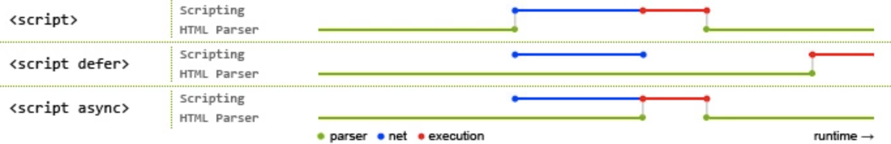
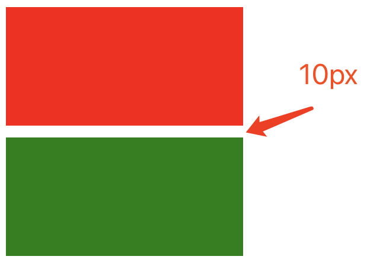

# HTML基础

## 1. HTML 文件中的 DOCTYPE 是什么作用？

HTML超文本标记语言: 是一个标记语言, 就有对应的语法标准

DOCTYPE 即 Document Type，网页文件的文档类型标准。

主要作用是告诉浏览器的解析器要使用哪种  **HTML规范** 或 **XHTML规范** 来解析页面。

DOCTYPE 需要放置在 HTML 文件的 `<html>`标签之前，如：

```html
<!DOCTYPE html>
<html>
  ...
</html> (目前主流)
```

```html
<!DOCTYPE HTML PUBLIC "-//W3C//DTD HTML 4.01//EN" "http://www.w3.org/TR/html4/strict.dtd">
<html>
  ...
</html> (早期)
```


## 2. HTML、XML、XHTML 之间有什么区别？

它们都属于标记语言。  

| 语言  | 中文名               | 说明                                                         |
| ----- | -------------------- | ------------------------------------------------------------ |
| HTML4 | 超文本标记语言       | 主要用于做界面呈现。HTML 是先有实现，后面才慢慢制定标准的，导致HTML⾮常混乱和松散，语法非常的不严谨。 |
| XML   | 可扩展标记语言       | 主要⽤于存储数据和结构。语法严谨，可扩展性强。由于 JSON 也有类似作⽤但更轻量⾼效， XML 的市场变得越来越⼩。 |
| XHTML | 可扩展超文本标记语言 | 属于加强版 HTML，为解决 HTML 的混乱问题而生，在语法方面变得和 XML 一样严格。另外，XHTML 的出现也催生了 HTML 5，让HTML向规范化严谨化过渡。 |
| HTML5 | 超文本标记语言       | 在HTML的基础上进行拓展，用于页面呈现 (目前标准)              |

XML的要求会比较严格:

1. 有且只能有一个根元素

2. 大小写敏感

3. 正确嵌套

4. 必须双引号

5. 必须闭合标签

   ...

```jsx
<?xml version="1.0" encoding="utf-8"?>
<root>
  <father id='box'>
    <child>小张</child>
    <child>小王</child>
  </father>
</root>
```

XHTML 和 HTML5 的历史延展: https://www.cnblogs.com/my-freedom/p/5796915.html


**番外:** 所以 HTML5 是HTML的新一代标准, 所谓的 H5 工程师这一词, 其实是国产词, 泛指新一代的web开发工程师, 

具体H5工程师, 做什么工作方向, 还是要看需求 (比如: 移动端开发, PC端网页开发, H5小游戏开发....)


## 3. 前缀为 `data-` 开头的元素属性是什么？

这是一种为 HTML 元素添加额外数据信息的方式，被称为 **自定义属性**。

我们可以直接在元素标签上声明这样的数据属性：

```html
<div id="mydiv" data-message="Hello,world" data-num="123"></div>
```

也可以使用 JavaScript 来操作元素的数据属性：

```js
let mydiv = document.getElementById('mydiv')

// 读取
console.log(mydiv.dataset.message)

// 写入
mydiv.dataset.foo = "bar!!!"
```

**注意：在各种现代前端框架出现后，这种原生的自定义属性已经变得不太常用了, 以前的使用频率非常高, 所以我们知道即可。**

例如: vue实现删除功能时需要 id, 可以直接传值

```jsx
<tr v-for="item in list" :key="item.id">
  <td>张三</td>
  <td>18</td>
  <td>体育好</td>
  <td>
    <button @click="del(item.id)">删除</button>
    <button>编辑</button>
  </td>
</tr>
```


## 4. 谈谈你对 HTML 语义化的理解？

考察核心点: 语义化的好处 (利于SEO, 可阅读性更好)

**语义化之前：**

在提倡语义化之前，你可能会使用各种各样的标签去实现同样的功能，比如：

- 使用 span、div、p、a 等做文字, 做按钮
- 使用 div 做一切

从功能方面来说，这确实是不存在什么问题的，完全可以达到功能效果。但这不符合直觉，非常不友好：

- 对人不友好：阅读代码的人不能一眼看出代码的功能
- 对机器不友好：解析代码的程序不能很好的对这些元素进行分类处理


**语义化之后：**

为了解决上面说的问题，HTML5 规范提倡语义化标签，即使⽤恰当语义的 HTML 标签让⻚⾯具有良好的结构与含义，⽐如：

- `<p>` 标签就代表段落
- `<article>` 代表正⽂内容
- `<button> `代表按钮
- `<header>` 代表头部
- 等等...

语义化的好处：

| 对开发者的好处                                               | 对机器/程序的好处                                            |
| ------------------------------------------------------------ | ------------------------------------------------------------ |
| 使⽤了语义化标签的程序，可读性明显增强，开发者可以比容易和清晰地看出⽹⻚的结构；这也更利于整个开发团队的协作开发和后续维护工作 | 带有语义的网页代码在⽂字类应用上的表现⼒丰富，利于搜索引擎爬⾍程序来爬取和提取出有效的信息；语义化标签还⽀持读屏软件，根据⽂章可以⾃动⽣成⽬录等，方便特殊人群无障碍的使用这些网页程序。 |

**语义化的适用性：**

语义化适合内容型的网站来使用（如简书、知乎），对其⽹站内容的传播有很⼤帮助。


## 5. HTML5 对比 HTML4 有哪些不同之处？

**考察点: 是否了解 html5 新增的一些新特性**

| 不同点                                  | 备注说明                                                     |
| --------------------------------------- | ------------------------------------------------------------ |
| 只有一种 DOCTYPE ⽂件类型声明(统一标准) | `<!DOCTYPE html>`                                            |
| 增加了一些新的标签元素(功能, 语义化)    | **section**, **video**, progress, **nav**, meter, time, **aside**, <br/>**canvas**, command, datalist, details, embed, figcaption, <br/>figure, **footer**, **header**, hgroup... |
| input 支持了几个新的类型值              | `date, email, url` 等等                                      |
| 新增了一些标签属性                      | charset（⽤于 meta 标签）；async（⽤于 script 标签）         |
| 新增的全域属性                          | contenteditable, draggable... <br/>hidden...                 |
| 新增API                                 | 本地存储, 地理定位, Canvas绘图, 拖拽API, 即时通信WebSocket... |

获取地理定位: navigator.geolocation.getCurrentPosition(successCallback, errorCallback) (为了安全, 需要在 https 网站使用)

记忆角度: 更标准, 新增标签, 新增type表单属性, 新增全域属性, 新增API...


## 6. meta 标签有哪些常用用法？

`<meta>` 标签的具体功能一般由 name/http-equiv 和 content 两部分属性来定义。

- 如果设置 name 属性，则它描述的是网页文档的信息（例如：作者、⽇期和时间、⽹⻚描述、 关键词）
- 如果设置 http-equiv 属性，则它描述的相当于是 HTTP 响应头信息（例如：网页内容信息, 网页缓存等）

**一些常用的功能及写法：**

1. 设置网页关键词 (SEO)

```html
<meta name="keywords" content="电商,好货,便宜">
```

2. 设置网页视口（viewport）控制视⼝的⼤⼩、缩放和⽐例等 (移动端开发)

```html
<meta name="viewport" content="width=device-width, initial-scale=1, maximum-scale=1">
```

3. 设置 http 响应头：Content-Type 网页内容类型  (字符集)

```html
<meta http-equiv="content-type" content="text/html;charset=utf-8">

<!-- 设置字符集可简写为 -->
<meta charset="utf-8">
```


## 7. img 标签的 srcset 的作用是什么？

**考察点: 处理响应式图片的方式** (css媒体查询换的是背景图片, 而不是 img 标签的 src)

开发者和设计师们竞相寻求 **处理响应式图片** 的方法。这的确是一个[棘手的问题](https://css-tricks.com/responsive-images-hard/) ，因为我们对同一个网站在众多设备宽度下，

使用同一图像源。你愿意在一个大显示屏上显示模糊地、马赛克状的图像？

你愿意在你的手机上加载一个巨大的（虽然更漂亮的）图像？这个问题令人左右为难。 [博客链接](https://www.jiangweishan.com/article/response-srcset-sizes.html)

其实通过使用 img 标签的 srcset 属性，可定义一组额外的图片集合，让浏览器根据不同的屏幕状况选取合适的图片来显示。

> 也就是图片的响应式处理能力。

如果你的响应式需求比较简单，只需要针对屏幕的不同 dpr （device pixel ratio，设备像素比）来决定图片的显示的话，

dpr 设备像素比, 越高, 能够显示的越清晰  (dpr: 2, dpr: 3)

那么就只要这么写：

```html

```

对于可变宽度的图像，我们使用`srcset`搭配`w`描述符以及`sizes`属性 。

- `w`描述符告诉浏览器列表中的每个图象的宽度。

- `sizes`属性需要至少包含两个值，是由逗号分隔的列表。

根据最新规范，如果`srcset`中任何图像使用了`w`描述符，那么必须要设置`sizes`属性。

`sizes`属性有两个值：

1. 第一个是媒体查询条件；

2. 第二个是图片对应的尺寸值，

   在特定媒体条件下，此值决定了图片的宽度。

   需要注意是，源图尺寸值不能使用百分比，如果要用100%,  `vw`是唯一可用的CSS单位。

```html

```

为 img 定义以上属性后，浏览器的工作流程如下：

1. 检查设备的实际宽度
2. 检查 img 标签的 sizes 属性中定义的媒体查询条件列表，并计算哪个条件最先匹配到
3. 得到图片此时的响应式宽度
4. 加载 srcset 中最接近, 最适合媒体查询匹配到的宽度的图片

注意: 测试时, 清除缓存测试, 因为一旦加载了高清图, 就不会也没有必要, 回过去再用小图替换了

且我们无法确定究竟显示哪张图像，因为每个浏览器根据我们提供的信息挑选适当图像的算法是有差异的。

(译者注：srcset和size列表是对浏览器的一个建议(hint)，而非指令。由浏览器根据其能力、网络等因素来决定。)


## 8. 响应式图片处理优化: Picture 标签

**考察点: 响应式图片处理**

`picture`元素就像是图像和其源的容器。浏览器仍然需要`img`元素，用来表明需要加载的图片

在 `<picture>` 下可放置零个或多个`<source>`标签、以及一个``标签，为不同的屏幕设备和场景显示不同的图片。

如果source匹配到了, 就会优先用匹配到的, 如果没有匹配到会往下继续找

使用`picture`元素选择图像，不会有歧义。

浏览器的工作流程如下：

- 浏览器会先根据当前的情况，去匹配和使用`<source>`提供的图片

- 如果未匹配到合适的`<source>`，就使用``标签提供的图片

```html
<picture>
  <source srcset="640.png" media="(min-width: 640px)">
  <source srcset="480.png" media="(min-width: 480px)">
  
</picture>
```


## 9. 在 script 标签上使用 defer 和 async 的区别是什么？

**明确: defer 和 async 的使用, 可以用于提升网页性能**

script标签存在两个属性，defer和async，因此 script标签 的使用分为三种情况：

1. `<script src="example.js"></script>`

   没有defer或async属性，浏览器会立即加载并执行相应的脚本。

   不等待后续加载的文档元素，读到就开始加载和执行，此举会阻塞后续文档的加载

2. `<script async src="example.js"></script>`

   有了async属性，表示后续文档的加载和渲染与js脚本的加载和执行是并行进行的，即异步执行；

3. `<script defer src="example.js"></script>`

   有了defer属性，加载后续文档的过程和js脚本的加载是并行进行的(异步)，此时的js脚本仅加载不执行, js脚本的执行需要等到文档所有元素解析完成之后，DOMContentLoaded事件触发执行之前。

下图是使用了 defer、async、和未使用时的运行情况对比：



> 【上图的图例说明】
>
> 绿线：HTML 的解析时间
>
> 蓝线：JS 脚本的加载时间
>
> 红色：JS 脚本的执行时间

从图中我们可以明确一下几点：

　　1.defer和async在网络加载过程是一致的，都是异步执行的；(放在页面顶部, 也不会阻塞页面的加载, 与页面加载同时进行)

　　2.两者的区别, 脚本加载完成之后, async是立刻执行, defer会等一等 (等前面的defer脚本执行, 等dom的加载)

所以, js脚本加上 async 或 defer, 放在头部可以减少网页的下载加载时间, 如果不考虑兼容性, 可以用于优化页面加载的性能

```jsx
<script src="https://cdn.bootcdn.net/ajax/libs/vue/2.6.12/vue.js"></script>
<script src="https://cdn.bootcdn.net/ajax/libs/element-ui/2.15.0/index.js"></script>
```


## 10. 前端做本地数据存储的方式有哪些？


1. Cookies
2. localStorage
3. sessionStorage
4. Web SQL
5. IndexedDB


## 11. 以上几种前端存储的区别是什么？

| 方式名称       | 标准说明     | 功能说明                                                     |
| -------------- | ------------ | ------------------------------------------------------------ |
| Cookies        | HTML5 前加入 | 1.会为每个请求自动携带所有的Cookies数据，比较方便，但是也是缺点，浪费流量；<br>2.每个domain(站点)限制存储20个cookie；<br/>3.容量只有4K<br/>4.浏览器API比较原始，需要自行封装操作。 (js-cookie) |
| localStorage   | HTML5 加入   | 1.兼容IE8+，操作方便；<br/>2.永久存储，除非手动删除；<br/>3.容量为5M |
| sessionStorage | HTML5 加入   | 1.功能基本与 localStorage 相似，但当前页面关闭后即被自动清理；<br/>2.与Cookies、localStorage 不同点是不能在所有同源窗口间共享，属于会话级别的存储 |
| Web SQL        | 非标准功能   | 1.2010年已被废弃，但一些主流浏览器中都有相关的实现；<br/>2.类似于 SQLite 数据库，是一种真正意义上的关系型数据库，⽤SQL进⾏操作； |
| IndexedDB      | HTML5 加入   | 1.是一种 NoSQL 数据库，⽤键值对进⾏储存，可进⾏快速读取操作；<br/>2.适合复杂 Web存储场景，⽤JS操作⽅便 (前端大量存数据的场景较少, 如果有, 可以用) <br />3.存储空间容量, 大于等于 250MB，甚至没有上限 |

---


# CSS基础

## 1. CSS选择器的优先级是怎么样的？

**CSS选择器的优先级顺序：**

`内联样式` > `ID选择器` > `类选择器` > `标签选择器`

**优先级的计算：**

优先级是由 A、B、C、D 四个值来决定的，具体计算规则如下

- A={如果存在内联样式则为1，否则为0}
- B={ID选择器出现的次数}
- C={类选择器、属性选择器、伪类选择器出现的总次数}
- D={标签选择器、伪元素选择器出现的总次数}

**计算示例：**

样式一：

```css
/*
  A=0   不存在内联样式
  B=0   不存在ID选择器
  C=1   有一个类选择器
  D=3   有三个标签选择器

  最终计算结果：{0,0,1,3}
*/
div ul li .red { ... }
```

样式二：

```css
/*
  A=0   不存在内联样式
  B=1   有一个ID选择器
  C=0   不存在类选择器
  D=0   不存在标签选择器

  最终计算结果：{0,1,0,0}
*/
#mydiv { ... }
```

计算完成后，我们通过从A到D的顺序进行值的大小比较，权重由A到D从高到低，只要比较出最大值即可。例如上面的两个样式：

```md
1. 样式一的A=0，样式二的A=0  【相等，继续往下比较】
2. 样式一的B=0 < 样式二的B=1 【样式二的大，不继续往下比了，即认为样式二的优先级更高】
```


## 2. 通过 CSS 的哪些方式可以实现隐藏页面上的元素？

| 方式                  | 说明                                                         |
| --------------------- | ------------------------------------------------------------ |
| opacity: 0            | 通过将元素的透明度设置为0，实现看起来隐藏的效果；但是依然会占用空间并可以进行交互 |
| visibility: hidden    | 与透明度为0的方案非常类似，会占据空间，但不可以进行交互      |
| overflow: hidden      | 只会隐藏元素溢出的部分；占据空间且不可交互                   |
| display: none         | 可以彻底隐藏元素并从文档流中消失，不占据空间也不能交互，且不影响布局 |
| z-index: -9999        | 通过将元素的层级置于最底层，让其他元素覆盖住它，达到看起来隐藏的效果 |
| transform: scale(0,0) | 通过将元素进行缩放，缩小为0；依然会占据空间，但不可交互      |
| left: -9999px         | 通过将元素定位到屏幕外面，达到看起来看不到的效果             |


## 3. px、em、rem之间有什么区别？

**考察点: 相对单位, 绝对单位, 以及适配问题**

| 单位名称 | 说明                                                         |
| -------- | ------------------------------------------------------------ |
| px       | 绝对单位。代表像素数量，页面会按照给出的精确像素进行展示     |
| em       | 相对单位。默认的基准点为父元素的字体大小，而如果自身定义了字体大小则按自身的来算。所以即使在同一个页面内，1em可能不是一个固定的值。 |
| rem      | 相对单位。可以理解为 `root em`，即基准点为根元素`<html>`的字体大小。rem是CSS3中新增单位，Chrome/FireFox/IE9+都支持, 一般用于做移动端适配 |

正常开发 px 使用率较高, 如果要做 rem 适配, 会用到 rem 单位!

rem布局的原理:

1. 使用 rem 为单位
2. 动态的设置 html font-size (媒体查询, js设置, 插件设置都可以)

webpack有工具, 可以写 px, 自动转 rem  https://youzan.github.io/vant/#/zh-CN/advanced-usage


## 4. 让元素水平居中的方法有哪些？

**方法一：使用 margin**

通过为元素设置左右的 margin 为 auto，实现让元素居中。

```html
<div class="center">本内容会居中</div>
```

```scss
.center {
   height: 500px;
   width: 500px;
   background-color: pink;
   margin: 0 auto;
}
```


**方式二: 转成行内块,  给父盒子设置 text-align: center**

```html
<div class="father">
	<div class="center">我是内容盒子</div>
</div>
```

```css
.father {
  text-align: center;
}
.center {
  width: 400px;
  height: 400px;
  background-color: pink;
  display: inline-block;
}
```


**方法三：使用 flex 布局**

使用 flex 提供的子元素居中排列功能，对元素进行居中。

```html
<div class="father">
	<div class="center">我是内容盒子</div>
</div>
```

```css
.father {
  display: flex;
  background-color: skyblue;
  justify-content: center;
  align-items: center;
}
.center {
  width: 400px;
  height: 400px;
  background-color: pink;
}
```


**方式四: 使用定位布局**

```html
<div class="father">
  <div class="center">我是内容盒子</div>
</div>
```

```css
.father {
  background-color: skyblue;
  position: relative;
  height: 500px;
}
.center {
  width: 400px;
  height: 400px;
  background-color: pink;
  position: absolute;
  left: 50%;
  top: 50%;
  transform: translate(-50%, -50%);
}
```

[【更多方式参考】实现水平居中垂直居中](https://www.cnblogs.com/chengxs/p/11231906.html)


## 5. 在 CSS 中有哪些定位方式？

也就是 position 样式的几个属性。


**static 正常文档流定位**

- 此时设置 top、right、bottom、left 以及 z-index 都无效

- 块级元素遵循从上往下纵向排列，行级元素遵循从左到右排列


**relative 相对定位**

这个 **“相对”** 是指相对于正常文档流的位置。


**absolute 绝对定位**

当前元素相对于 **最近的非 static 定位的祖先元素 **来确定自己的偏移位置。

例如，当前为 absolute 的元素的父元素、祖父元素都为 relative，则当前元素会相对于父元素进行偏移定位。


**fixed 固定定位**

当前元素相对于屏幕视口 viewport 来确定自己的位置。并且当屏幕滚动时，当前元素的位置也不会发生改变。


**sticky 粘性定位**

这个定位方式有点像 relative 和 fixed 的结合。当它的父元素在视口区域、并进入 top 值给定的范围内时，当前元素就以 fixed 的方式进行定位，否则就以 relative 的方式进行定位。

```html
<style>
  * {
    margin: 0;
    padding: 0;
  }
  .header {
    width: 100%;
    height: 100px;
    background-color: orange;
  }
  .nav {
    width: 100%;
    height: 200px;
    background-color: pink;
    position: sticky;
    top: 0px;
  }
  .main {
    width: 100%;
    height: 100px;
    background-color: skyblue;
  }

</style>

<div class="header">我是头部</div>
<div class="nav">我是导航</div>
<div class="container">
    <div class="main">我是主体部分1</div>
    <div class="main">我是主体部分2</div>
    <div class="main">我是主体部分3</div>
    <div class="main">我是主体部分4</div>
    <div class="main">我是主体部分5</div>
    <div class="main">我是主体部分6</div>
    <div class="main">我是主体部分7</div>
    <div class="main">我是主体部分8</div>
</div>
```


## 6. 如何理解 z-index？

可以将它看做三维坐标系中的z轴方向上的图层层叠顺序。

元素默认的 z-index 为 0，可通过修改 z-index 来控制设置了postion 值的元素的图层位置。


可以将这种关系想象成一摞书本，通过 z-index 可以改变一本书在这摞书中的上下位置。

z-index的小坑, 如果父辈元素有定位, 且配置了z-index, 优先按照父辈元素的定位的z-index进行比较层级

```html
<style>
  .father {
    width: 100%;
    height: 200px;
    position: relative;
    background-color: skyblue;
    z-index: 1;
  }
  .son {
    position: absolute;
    width: 100px;
    height: 100px;
    background-color: red;
    left: 0;
    top: 0;
    z-index: 999;
  }
  .box2 {
    position: absolute;
    width: 100px;
    height: 100px;
    background-color: blue;
    left: 0;
    top: 0;
    z-index: 100;
  }
</style>

<div class="father">
  <div class="son"></div>
</div>

<div class="box2"></div>
```


## 7. 如何清除浮动 ？

**考察: css基本功**

可以有以下几种方式：

1. 定高法

2. 使用一个空的div，并设置样式

```html
<div style="clear:both"></div>
```

3. 为父元素添加 `overflow: hidden`

4. 定义一个 clearfix 样式类

```css
.clearfix:after {
  content: "";  			/*设置内容为空*/
  height: 0;    			/*高度为0*/
  line-height: 0;			/*行高为0*/
  display: block;			/*将文本转为块级元素*/
  visibility: hidden;	/*将元素隐藏*/
  clear: both; 				/*清除浮动*/
}

.clearfix {
  zoom: 1; 				/*为了兼容IE*/
}
```

说明：当前 flex 已成为主流布局方式，适应性强, 且稳定, 所以浮动使用率目前已逐步降低。 


## 8. 谈谈你对 BFC 的理解？

**什么是 BFC：**

BFC 的全称是 Block Formatting Context，块级格式化上下文。这是一个用于在盒模型下布局块级盒子的独立渲染区域，

将处于BFC区域内和区域外的元素进行互相隔离。


**何时会形成 BFC：**

满足下列条件之一就可触发BFC：

- HTML根元素
- position 值为 `absolute` 或 `fixed`
- float 值不为 `none`
- overflow 值不为 `visible`
- display 值为 `inline-block`、`table-cell` 或 `table-caption`


**BFC 的应用场景：**

1. 场景一：防止两个相邻块级元素的上下 margin 发生重叠 (**上下margin合并问题**)

属于同一 BFC 的, 两个相邻块级子元素的上下 margin 会重叠，如果想让它们不重叠，可通过让这两个相邻块级子元素分属于不同的BFC。

以下示例代码中的两个盒子的上下外边距会重合（即它们都设置了10px的外边距，我们期望它们之间的间距是 20px，但实际效果却只有 10px）：

```html
<style>
  .box1 {
    width: 200px;
    height: 100px;
    background-color: red;
    margin-bottom: 10px; /* 下外边距为 10px */
  }

  .box2 {
    width: 200px;
    height: 100px;
    background-color: green;
    margin-top: 10px;  /* 上外边距为 10px */
  }
</style>

<div class="box1"></div>
<div class="box2"></div>
```



下面我们让其中一个盒子触发BFC，从而达到间隔 20px 的期望效果：

```css
.box2 {
  width: 200px;
  height: 100px;
  background-color: green;
  margin-top: 10px;
  display: inline-block; /* 通过设置 display 为 inline-block 可以触发 BFC */
}
```


2. 场景二：**清除浮动**

以下示例代码中， 容器元素 box1 的高度会没有高：

```html
<style>
  .box1 {
    width: 200px;
    background-color: red;
  }

  .box2 {
    float: left;
    background-color: green;
  }
</style>

<div class="box1">
  <div class="box2">Hello,world</div>
  <div class="box2">Hello,world</div>
  <div class="box2">Hello,world</div>
</div>
```

而通过为 box1 添加 BFC 触发条件，可以让它的高度变回正常状态：

```css
.box1 {
  width: 200px;
  background-color: red;
  overflow: hidden;
}
```


3. 场景三：**实现自适应布局**, 防止元素被浮动元素覆盖(左边固定, 右边自适应)

以下示例中，box2 会被设置了浮动的 box1 覆盖：

```html
<style>
  .box1 {
    float: left;
    width: 300px;
    background-color: red;
    height: 400px;
  }

  .box2 {
    background-color: blue;
    height: 600px;
  }
</style>

<div class="box1"></div>
<div class="box2"></div>
```


要避免这种覆盖行为，可以让 box2 触发 BFC,  实现布局效果, 左边固定右边自适应：

```css
.box2 {
  background-color: blue;
  height: 600px;
  overflow: hidden; /* 将 overflow 设置为非 visible 值可触发 BFC */
}
```


[参考文章：深入理解BFC](https://www.cnblogs.com/xiaohuochai/p/5248536.html)


## 9. 什么是CSS Sprites以及它的好处？

**考察: 性能优化的方案**

CSS Sprites，俗称雪碧图、精灵图。这是一种CSS图片合并技术，就是将CSS中原先引用的一些较小的图片，合并成一张稍大的图片后再引用的技术方案。它可以减少请求多张小图片带来的网络消耗（因为发起的HTTP请求数变少了），并实现提前加载资源的效果。

**操作方式：**

可以手工使用图片编辑软件（如Photoshop），将多张小图片合并编辑变成一张大图片，并针对这张大图片，编写CSS样式来引用这张大图片中对应位置的小图片（涉及到的样式：background-image、background-position、background-size）。然后在HTML元素中使用这些样式即可。

https://img.alicdn.com/tfs/TB1eiXTXlTH8KJjy0FiXXcRsXXa-24-595.png

**缺点：**

- CSS Sprites中任意一张小图的改动，都需要重新生成大图；并且用户端需要重新下载整张大图，这就降低了浏览器缓存的优势
- 随着HTTP2的逐渐普及，HTTP2的多路复用机制可以解决请求多个小图片所创建多个HTTP请求的消耗，让CSS Sprites存在的价值降低了
- 图片如果放大, 是会失真

目前其他主流的处理图片的方案:  iconfont 字体图标, svg矢量图...


## 10. 你对媒体查询的理解是什么样的？

**考察点: 响应式适配**, 根据不同的屏幕尺寸, 显示不同的效果 (设置盒子的样式)

媒体查询是自 CSS3 开始加入的一个功能。它可以进行响应式适配展示。

媒体查询由两部分组成：

- 一个可选的媒体类型（如 screen、print 等）
- 零个或多个媒体功能限定表达式（如 max-width: 500px、orientation: landscape 等）

这两部分最终都会被解析为 true 或 false 值，然后整个媒体查询值为 true，则和该媒体查询关联的样式就生效，否则就不生效。

**使用示例：**

```css
/* 在css样式表的定义中直接使用媒体查询 */ 
.container {
  width: 600px;
  height: 200px;
  background-color: pink;
  margin: 0 auto;
}
@media screen and (max-width: 767px) {
  .container {
    width: 100%;
  }
}
@media screen and (min-width: 768px) and (max-width: 991px) {
  .container {
    width: 750px;
  }
}
@media screen and (min-width: 992px) and (max-width: 1199px) {
  .container {
    width: 980px;
  }
}
@media screen and (min-width: 1200px) {
  .container {
    width: 1170px;
  }
}
@media screen and (width: 1200px) {
  .container {
    background-color: skyblue;
  }
}
```

[参考文章：深入理解CSS媒体查询](https://www.cnblogs.com/xiaohuochai/p/5848612.html)


## 11. 你对盒子模型的理解是什么样的？

浏览器的渲染引擎在对网页文档进行布局时，会按照 “CSS 基础盒模型” （CSS Basic Box Model）标准，将文档中的所有元素都表示为一个个矩形的盒子，再用 CSS 去决定这些盒子的大小尺寸、显示位置、以及其他属性（如颜色、背景、边框等）。


下图就是盒模型示意图，它由几部分组成：

- 内容（content）
- 内边距（padding）
- 边框（border）
- 外边距（margin）


## 12. 标准盒模型和怪异盒模型有哪些区别？

两者的区别主要体现在元素尺寸的表示上。

**盒模型的指定：**

在CSS3中，我们可以通过设置 box-sizing 的值来决定具体使用何种盒模型：

- content-box    标准盒模型
- border-box     怪异盒模型

**标准盒模型：**

box-sizing: content-box; (默认值)

在标准盒模型下，元素的宽（width）和高（height）值即为盒模型中内容（content）的实际宽高值。


因此，计算一个元素宽度的公式如下(不考虑margin, margin是外边距,  如果是计算占用页面的空间, 就要带上margin)：

> 盒子宽度 =  `border-left` + `padding-left` + `width` + `padding-right` + `border-right`
>
> 占据页面宽度 = `margin-left` + `border-left` + `padding-left` + `width` + `padding-right` + `border-right` + `margin-right`


**怪异盒模型：**

box-sizing: border-box; (目前主流常用值)

在怪异盒模型下，元素的 width 和 height 值却不是 content 的实际宽高，而是去除 margin 后剩下的元素占用区域的宽高，即：


因此，计算一个元素占用了页面总宽度的公式如下：

> 盒子宽度 =  `width`
>
> 盒子占据页面宽度 = `margin-left` + `width` + `margin-right`

[参考文章：深入理解盒模型](https://www.cnblogs.com/xiaohuochai/p/5202597.html)


## 13. 说说伪类和伪元素的区别？

**什么是伪类？**

伪类（pseudo-class）是以冒号`:`为前缀，可被添加到⼀个选择器的末尾的关键字。

它用于让样式在元素的特定状态下才被应用到实际的元素上。比如：`:checked`、`:hover`、`:disabled`、 `:first-child`等。

:hover

:nth-child(1)

:nth-child(2)

:checked

注意: 伪类, 虽然是写法比较特殊, css选择器的权重, 和类一致的


**什么是伪元素？**

:before / :after

伪元素⽤于创建⼀些并不在 DOM 树中的元素，并为其添加样式。伪元素的语法和伪类类似，可以一个冒号或两个冒号为前缀。

⽐如，可以通过 `:before` 、`:after` 来在⼀个元素前、后增加⼀些额外的⽂本并为它们添加样式；

并且，虽然⽤户可以看到这些⽂本，但其实它们并不在 DOM 树中。(**坑: 伪元素是无法注册事件的, 所以不要通过js控制伪元素**)


**两者的区别**

虽然它们在语法上是一致的，但是它们的功能区别还是非常明显的。

- 伪类是用来匹配元素的特殊状态的
- 伪元素是用来匹配元素的隶属元素的，这些隶属元素可以在界面中展示，但在 DOM 中不体现

[参考文章：伪类与伪元素](http://www.alloyteam.com/2016/05/summary-of-pseudo-classes-and-pseudo-elements/)


## 14. 谈谈你对 flex 的理解？

在真实的应用场景中，通常会遇到各种各样不同尺⼨和分辨率的设备，为了能在所有这些设备上正常的布局我们的应用界面，就需要响应式的界⾯设计方式来满⾜这种复杂的布局需求。

flex 弹性盒模型的优势在于开发⼈员只需要声明布局应该具有的⾏为，⽽不需要给出具体的实现⽅式，浏览器负责完成实际布局，当布局涉及到不定宽度，分布对⻬的场景时，就要优先考虑弹性盒布局。 

你能联想到的flex语法有哪些呢?

flex-direction: 调整主轴方向

```txt
row：主轴方向为水平向右
column：主轴方向为竖直向下
row-reverse:主轴方向为水平向左
column-reverse:主轴方向是竖直向上。
```

justify-content主要用来设置**主轴方向的对齐方式**

```
flex-start: 弹性盒子元素将向起始位置对齐
flex-end: 弹性盒子元素将向结束位置对齐。
center: 弹性盒子元素将向行中间位置对齐
space-around: 弹性盒子元素会平均地分布在行里
space-between:第一个贴左边，最后一个贴右边，其他盒子均分，保证每个盒子之间的空隙是相等的。
```

align-items用于调整**侧轴的对齐方式**

```txt
flex-start： 元素在侧轴的起始位置对齐。 
flex-end： 元素在侧轴的结束位置对齐。
center： 元素在侧轴上居中对齐。
stretch： 元素的高度会被拉伸到最大（不给高度时, 才拉伸）。
```

flex-wrap属性控制flex容器是单行或者多行,默认不换行

```txt
nowrap： 不换行（默认），如果宽度溢出，会压缩子盒子的宽度。
wrap： 当宽度不够的时候，会换行。
```

align-content用来设置多行的flex容器的排列方式

```txt
flex-start： 各行向侧轴的起始位置堆叠。 
flex-end： 各行向弹性盒容器的结束位置堆叠。
center： 各行向弹性盒容器的中间位置堆叠。
space-around： 各行在侧轴中平均分布。 
space-between： 第一行贴上边，最后一个行贴下边,其他行在弹性盒容器中平均分布。 
stretch：拉伸，不设置高度的情况下。
```

> 可参考 [flex布局教程](http://www.ruanyifeng.com/blog/2015/07/flex-grammar.html)

---