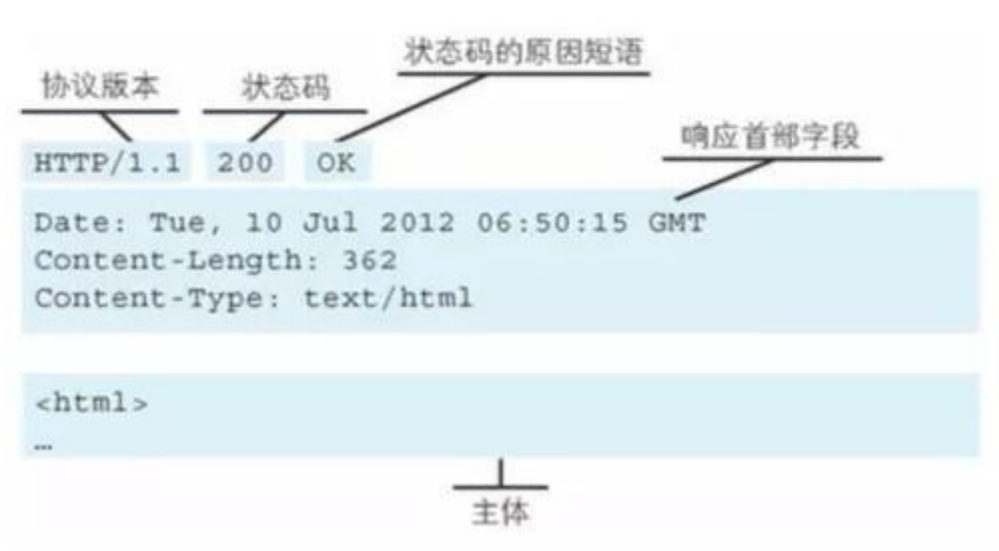
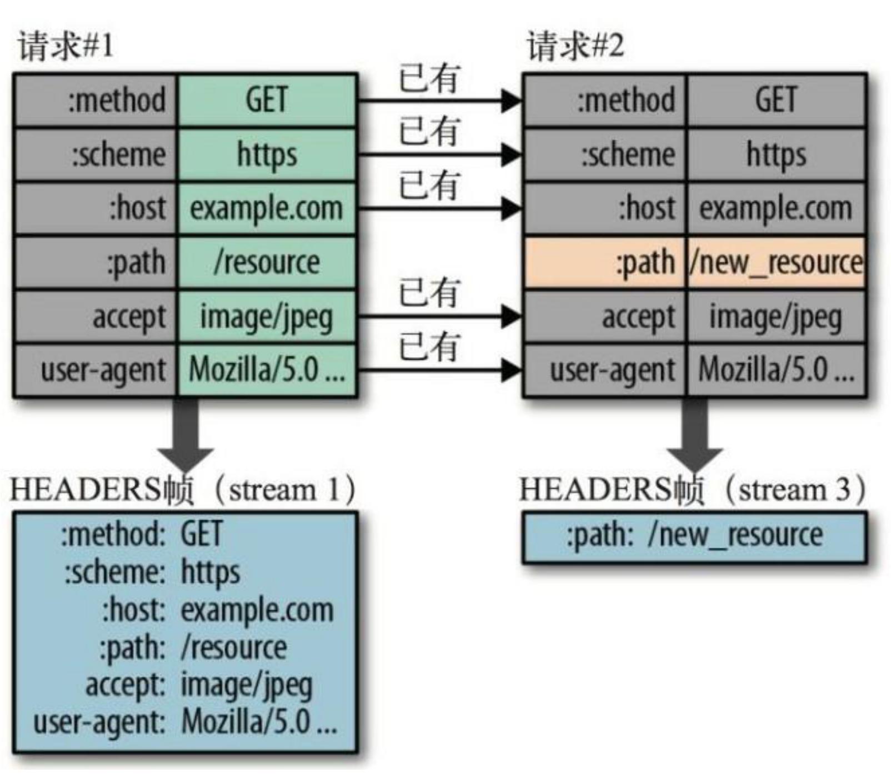
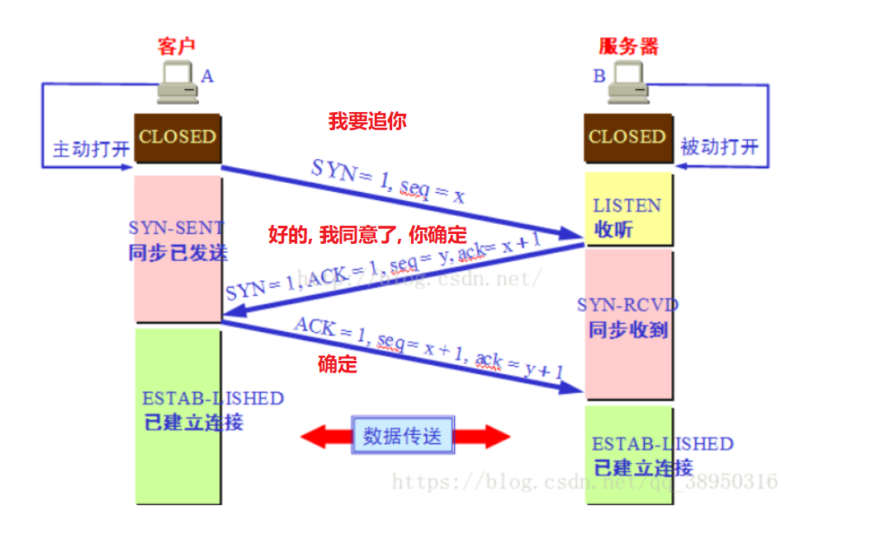
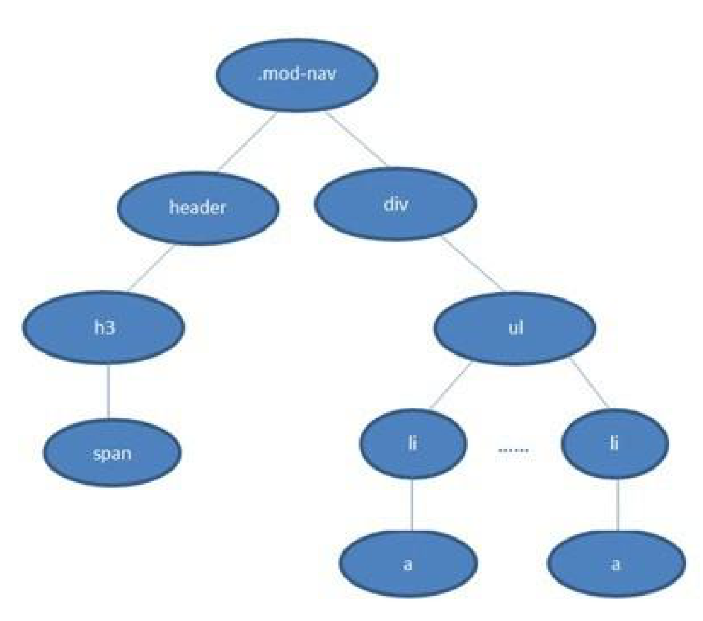
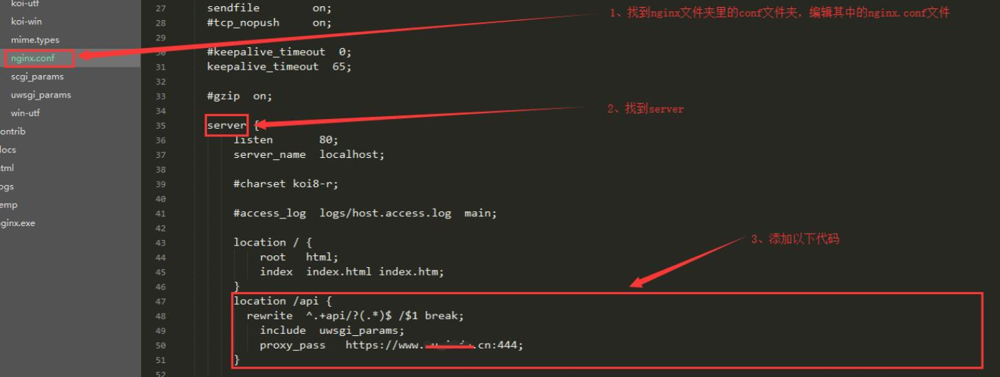

# HTTP协议

## 1. HTTP有哪些⽅法？

HTTP 1.0 标准中，定义了3种请求⽅法：GET、POST、HEAD

HTTP 1.1 标准中，新增了请求⽅法：PUT、PATCH、DELETE、OPTIONS、TRACE、CONNECT


## 2. 各个HTTP方法的具体作用是什么？

|  方法   | 功能                                                         |
| :-----: | ------------------------------------------------------------ |
|   GET   | 通常⽤于请求服务器发送某些资源                               |
|  POST   | 发送数据给服务器                                             |
|  HEAD   | 请求资源的头部信息, 并且这些头部与 HTTP GET ⽅法请求时返回的⼀致。<br />该请求⽅法的⼀个使⽤场景是在下载⼀个⼤⽂件前先获取其⼤⼩再决定是否要下载, 以此可以节约带宽资源 |
|   PUT   | ⽤于全量修改⽬标资源 (看接口, 也可以用于添加)                |
| DELETE  | ⽤于删除指定的资源                                           |
| OPTIONS | ⽤于获取⽬的资源所⽀持的通信选项 (跨域请求前, 预检请求, 判断目标是否安全) |
|  TRACE  | 该方法会  让服务器  原样返回任意客户端请求的信息内容, 用于诊断和判断 |
| CONNECT | HTTP/1.1协议中预留给能够将连接改为管道⽅式的代理服务器<br />(把服务器作为跳板，让服务器代替用户去访问其它网页, 之后把数据原原本本的返回给用户) |
|  PATCH  | ⽤于对资源进⾏部分修改                                       |


GET POST PUT PATCH DELETE

GET/DELETE  参数是在地址栏中传递的

PUT/PATCH/POST 参数是在请求体传递的


## 3. GET方法和POST方法有何区别？

默认的http请求的内容, 在网络中传输, 明文的形式传递的  (https 对内容加密)

|                  | GET方法                                                      | POST方法                                           |
| ---------------- | ------------------------------------------------------------ | -------------------------------------------------- |
| **数据传输⽅式** | 通过URL传输数据 (地址栏拼接参数)                             | 通过请求体传输                                     |
| **数据安全**     | 数据暴露在URL中，可通过浏览历史记录、缓存等很容易查到数据信息 | 数据因为在请求主体内，<br />所以有⼀定的安全性保证 |
| **数据类型**     | 只允许 ASCII 字符                                            | ⽆限制                                             |
| **GET⽆害**      | 刷新、后退等浏览器操作是⽆害的                               | 可能会引起重复提交表单                             |
| **功能特性**     | 安全且幂等（这⾥的安全是指只读特性，就是使⽤这个⽅法不会引起服务器状态变化。<br />**幂等的概念是指同⼀个请求⽅法执⾏多次和仅执⾏⼀次的效果完全相同）** | ⾮安全(会引起服务器端的变化)、**⾮幂等**           |


## 4. HTTP请求报文是什么样的？

HTTP 请求报⽂的组成：请求⾏、请求头、(空⾏)、请求体。

实际请求报文实例:


**请求行**

包含了请求⽅法、URL、HTTP 协议版本，它们之间⽤空格进行分隔。例如：

```bash
GET http://www.abc.com/articles HTTP/1.1
```

**请求头**

请求头由键值对组成，每⾏⼀对，键值之间⽤英⽂冒号`:`进行分隔。例如：

```
Content-Type: application/json
Host: www.abc.com
```

**请求体**

请求体中放置 POST、PUT、PATCH 等请求方法所需要携带的数据。


## 5. HTTP响应报文是什么样的？

HTTP 响应报⽂的组成: 响应⾏、响应头、空⾏、响应体。



**响应行**

响应行由协议版本、状态码、状态码的原因短语3个内容组成，中间以空格分隔。例如：

```bash
HTTP/1.1 200 OK
```


**响应头**

响应头由键值对组成，每⾏⼀对，键值之间⽤英⽂冒号`:`进行分隔。例如：

```
Content-Length: 1024
Content-Type: application/json
```


**响应体**

服务器发送过来的数据。

小结:


## 6. 你了解的HTTP状态码有哪些？

**成功（2XX）**

| 状态码 | 原因短语        | 说明                                                         |
| ------ | --------------- | ------------------------------------------------------------ |
| 200    | OK              | 表示从客户端发来的请求在服务器端被正确处理                   |
| 201    | Created         | 请求已经被实现，⽽且有⼀个新的资源已经依据请求的需要⽽建⽴<br />通常是在POST请求，或是某些PUT请求之后创建了内容, 进行的返回的响应 |
| 202    | Accepted        | 请求服务器已接受，但是尚未处理，不保证完成请求<br />适合异步任务或者说需要处理时间比较长的请求，避免HTTP连接一直占用 |
| 204    | No content      | 表示请求成功，但响应报⽂不含实体的主体部分                   |
| 206    | Partial Content | 进⾏的是范围请求, 表示服务器已经成功处理了部分 GET 请求<br />响应头中会包含获取的内容范围 (常用于分段下载) |


**重定向（3XX）**

| 状态码  | 原因短语           | 说明                                                         |
| ------- | ------------------ | ------------------------------------------------------------ |
| 301     | Moved Permanently  | 永久性重定向，表示资源已被分配了新的 URL<br />比如，我们访问 **http**://www.baidu.com 会跳转到 **https**://www.baidu.com |
| 302     | Found              | 临时性重定向，表示资源临时被分配了新的 URL, 支持搜索引擎优化<br />首页, 个人中心, 遇到了需要登录才能操作的内容, 重定向 到 登录页 |
| 303     | See Other          | 对于POST请求，它表示请求已经被处理，客户端可以接着使用GET方法去请求Location里的URI。 |
| **304** | **Not Modified**   | **自从上次请求后，请求的网页内容未修改过。<br />服务器返回此响应时，不会返回网页内容。(协商缓存)** |
| 307     | Temporary Redirect | 对于POST请求，表示请求还没有被处理，客户端应该向Location里的URI重新发起POST请求。<br />不对请求做额外处理, 正常发送请求, 请求location中的url地址 |

因为post请求, 是非幂等的,  从302中, 细化出了 303 和 307

简而言之: 

- 301  302  307  都是重定向
- 304 协商缓存


**客户端错误（4XX）**

| 状态码  | 原因短语        | 说明                                        |
| ------- | --------------- | ------------------------------------------- |
| **400** | **Bad Request** | **请求报⽂存在语法错误(（传参格式不正确）** |
| 401     | UnAuthorized    | 权限认证未通过(没有权限)                    |
| 403     | Forbidden       | 表示对请求资源的访问被服务器拒绝            |
| 404     | Not Found       | 表示在服务器上没有找到请求的资源            |
| 408     | Request Timeout | 客户端请求超时                              |
| 409     | Confict         | 请求的资源可能引起冲突                      |


**服务端错误（5XX）**

| 状态码 | 原因短语                   | 说明                                                         |
| ------ | -------------------------- | ------------------------------------------------------------ |
| 500    | Internal Sever Error       | 表示服务器端在执⾏请求时发⽣了错误                           |
| 501    | Not Implemented            | 请求超出服务器能⼒范围，例如服务器不⽀持当前请求所需要的某个功能，<br />或者请求是服务器不⽀持的某个⽅法 |
| 503    | Service Unavailable        | 表明服务器暂时处于超负载或正在停机维护，⽆法处理请求         |
| 505    | Http Version Not Supported | 服务器不⽀持，或者拒绝⽀持在请求中使⽤的 HTTP 版本           |


## 7. HTTP的keep-alive是什么作用？

作用：使客户端到服务器端的连接**持续有效**(长连接)，当出现对服务器的后继请求时，

Keep-Alive功能避免了建立或者重新建立连接。


早期 HTTP/1.0 在每次请求的时候，都要创建⼀个新的连接，⽽创建连接的过程需要消耗资源和时间，

为了减少资源消耗、缩短响应时间，就需要复⽤已有连接。


在后来的 HTTP/1.0 以及 HTTP/1.1 中引⼊了复⽤连接的机制，也就是在请求头中加⼊Connection: keep-alive，

以此告诉对⽅这个请求响应完成后不要关闭连接，下⼀次还⽤这个请求的连接进行后续交流。

**协议规定，如果想要保持连接，则需要在请求头中加上 Connection: keep-alive。** 


**keep-alive 的优点** (复用连接)

- 较少的 CPU 和内存的占⽤（因为要打开的连接数变少了, 复用了连接） 
- 减少了后续请求的延迟（⽆需再进⾏握⼿） 
- ...

缺点: 因为在处理的暂停期间，本来可以释放的资源仍旧被占用。请求已经都结束了, 但是还一直连接着也不合适

解决：Keep-Alive: timeout=5, max=100

- timeout：过期时间5秒（对应httpd.conf里的参数是：KeepAliveTimeout），

- max是最多一百次请求，强制断掉连接。

  就是在timeout时间内又有新的连接过来，同时max会自动减1，直到为0，强制断掉。


## 8. 为什么需要HTTPS？

HTTPS 是安全版的 HTTP。

HTTP 协议在传输数据时采用的是明⽂方式传递，因此，⼀些敏感信息的传输就变得很不安全。

而 HTTPS 就是为了解决 HTTP 的不安全⽽产⽣的。


## 9. HTTPS是如何保证安全的？

HTTPS 在传输数据的过程中会对数据进行加密处理，保证安全性。

那HTTPS采用的什么样的加密方式呢？我们来了解下一些加密的基本概念。

目前常见的加密算法可以分成三类，对称加密算法，非对称加密算法和Hash算法。


### 9.1 **什么是对称加密？**

对称加密的特点是文件加密和解密使用相同的密钥，即加密密钥也可以用作解密密钥，

这种方法在密码学中叫做对称加密算法，对称加密算法使用起来简单快捷，密钥较短，且破译困难

通信的双⽅都使⽤同⼀个秘钥进⾏加解密。⽐如，两个人事先约定的暗号，就属于对称加密。 


对称加密的特点是：

- 优点:

  计算量小、加密速度快、加密效率高。

- 缺点: 

  在数据传送前，发送方和接收方必须商定好秘钥，然后双方保存好秘钥。

  如果一方的秘钥被泄露，那么加密信息也就不安全了

使用场景：本地数据加密、https通信、网络传输等

常见算法：AES、DES、3DES、DESX、Blowfish、IDEA、RC4、RC5、RC6


### 9.2 **什么是⾮对称加密？**

而加密和解密其实可以使用不同的规则，只要这两种规则之间存在某种对应关系即可，

这样就避免了直接传递密钥。这种新的加密模式被称为"非对称加密算法"。

通信的双方使用不同的秘钥进行加密解密，即秘钥对（私钥 + 公钥）。

特征: 私钥可以解密公钥加密的内容,  公钥可以解密私钥加密的内容


非对称加密的特点是：

- 优点：非对称加密与对称加密相比其安全性更好

- 缺点：加密和解密花费时间长、速度慢，只适合对少量数据进行加密。

使用场景：https会话前期、CA数字证书、信息加密、登录认证等

常见算法：RSA、ECC（移动设备用）、Diffie-Hellman、El Gamal、DSA（数字签名用）


### 9.3 **HTTPS 加密解决⽅案** 

结合了两种加密⽅式：

- 将 `对称加密的密钥` ⽤非对称加密的公钥, 进⾏加密并发送出去，接收⽅使⽤私钥解密得到 `对称加密密钥`

- 双⽅沟通时使⽤ `对称加密密钥` 进⾏

**可以看到，只有在发送秘钥阶段才使用非对称加密，而后续的通信都使用对称加密，这样解决了性能问题。**

HTTPS 目前所使用的 TLS或SSL协议,  就是目前采用的加密通道的规范协议 

它利用对称加密、(公私钥)非对称加密, 以及其密钥交换算法，可完成可信任的信息传输


### 9.4 数字证书

为了安全性, 一般还需要签发数字证书! 

客户端 和 服务器端要初步互通消息时,  客户端发送请求可以拿到公开的公钥信息

进而进行非对称加密, 使用公钥, 加密`对称加密密钥`, 传递给服务器, 后续通信都使用对称加密!


**问题是: 初步互通消息时, 如果请求拿到的公钥信息, 就是假的, 或者不安全的! 那么后续的所有操作, 都将是不安全的!**


所以, 就需要有数字证书(CA证书),  一般是CA机构颁发的, 证明这个公钥是安全可靠的!

**CA证书中心会对你网站的公钥, 网站的域名地址,  证书到期时间, 等一些相关信息一起加密签发数字证书, 保证你网站的安全性**


当公司申请了 CA 证书后, 就应该在响应时, 将数字证书一起发送给客户端


而客户端, 接收到消息后, 就可以查看证书

1. 如果正在访问的网站 和 证书记载的网址 不一致, 说明不安全,  可能被冒用, 浏览器就会发出警告!!! 

2. 如果签发证书的机构, 不权威, 发出警告 

   

3. 如果证书过期了, 浏览器也会发出警告


### 9.5 数字签名

但这还是有问题：如果证书被篡改了怎么办?

这时就需要用⼀个技术：**数字签名**。 (根据证书内容, 生成的一个唯一标识) 

数字签名就是先⽤ **CA ⾃带的 Hash 算法来计算出证书内容的⼀个摘要**，然后使⽤ CA 私钥进行加密，组成数字签名。

当别⼈把他的证书发过来时，**接收方⽤同样的算法再次⽣成摘要**，⽤ CA 公钥解密后得到CA生成的摘要，两者进行对⽐后,

就能确定中间是否被⼈篡改。这样就能最⼤程度的保证通信的安全了。

[博客参考](https://blog.csdn.net/u014044812/article/details/80723009)


## 10. HTTP2和HTTP1.x比，有什么优势和特点？

1. HTTP/2 采⽤`⼆进制格式`来传输数据，⽽⾮ HTTP 1.x 的⽂本格式，⼆进制协议`解析起来更⾼效`
2. HTTP/2 采用一些`头部压缩技术`，减少在请求和响应头中重复携带的数据，`降低网络负担`
3. HTTP/2 采⽤`服务器推送`方式，主动向客户端推送资源，提高页面加载效率
4. HTTP/2 采⽤`多路复用机制`，减少需要创建的连接数量，降低资源占用和性能消耗

下面是一些与之关联的技术知识。


**⼆进制格式分帧**

帧：HTTP/2 数据通信的最⼩单位消息，是指 HTTP/2 中逻辑上的 HTTP 消息（例如请求、响应等）。消息由⼀个或多个帧组成 

流：存在于连接中的⼀个虚拟通道，它可以承载双向消息，且每个流都有唯⼀的整数ID


**头部压缩**

在 HTTP/1.x 中，请求和响应中会重复携带一些不常改变、冗⻓的头数据，给⽹络带来额外负担。

在 HTTP/2 中，客户端和服务端使⽤ **“⾸部表”** 来跟踪和存储之前发送过的键值对，

相同的数据不再随着每次请求和响应发送。⾸部表在连接存续期间始终存在，由客户端和服务器共同渐进更新。

每个新的⾸部键值对，要么被追加到当前表的末尾，要么替换表中已存在的键值对。

> 可以简单的理解为：只发送差异数据，⽽不是全部发送，从⽽减少头部的信息量


下图为首部表的更新示意图：




**服务器推送**

服务端可以在发送⻚⾯ HTML 内容时，再主动推送一些其它资源，⽽不⽤等到浏览器解析到相应的位置时发起请求后再作响应。

例如，服务端可以主动把 JS 和 CSS ⽂件推送给客户端，⽽不需要客户端解析 HTML 时再发送这些请求。 


不过，服务端的主动推送行为，客户端有权利选择是否要接收。

如果服务端推送的资源已经被浏览器缓存过，浏览器可以通过发送 RST_STREAM 帧来拒收。


**多路复用**

在 HTTP 1.x 中如果想并发多个请求的话，必须使⽤多个 TCP 链接，但浏览器为了控制资源，

会对单个域名有 6-8 个 TCP 链接的数量限制。而在 HTTP 2 中： 

- 同域名下的所有通信，都在单个连接上完成 
- 单个连接可以承载任意数量的双向数据流 
- 数据流以消息的形式发送，⽽消息⼜由⼀个或多个帧组成（多个帧可以乱序发送，因为可以根据帧⾸部的流标识来重新组装）


[参考文章：HTTP/2特性及其在实际应用中的表现](https://zhuanlan.zhihu.com/p/30166894)


## 11. http缓存控制

### 11.1 基本认知

**Web 服务缓存** 大致可以分为：数据库缓存、服务器端缓存（代理服务器缓存、CDN 服务器缓存）、浏览器缓存。

**浏览器缓存** 也包含很多内容： HTTP 缓存、indexDB、cookie、localstorage 等等。**`这里我们只讨论 HTTP 缓存相关内容`。**

**HTTP缓存**:

- **强缓存**
- **协商缓存**

在具体了解 HTTP 缓存之前先来明确几个术语：

- 缓存命中率：从缓存中得到数据的请求数  与    所有请求数的比率。理想状态是越高越好。
- 过期内容：超过设置的有效时间，被标记为“陈旧”的内容。
- 验证：验证缓存中的过期内容是否仍然有效，验证通过的话刷新过期时间。
- 失效：失效就是把内容从缓存中移除。

**浏览器缓存主要是 HTTP 协议定义的缓存机制。**


**浏览器缓存, HTTP缓存分类**

浏览器缓存分为`强缓存 `和 `协商缓存`，浏览器加载一个页面的简单流程如下：

1. 浏览器先根据这个资源的  **http头信息**  来 **判断是否命中强缓存**。

   如果命中则直接加载在缓存中的资源，并不会将请求发送到服务器。（强缓存）

2. 如果未命中强缓存，则浏览器会将资源加载请求发送到服务器。

   服务器来判断浏览器本地缓存是否失效。

   若可以使用，则服务器并不会返回资源信息，浏览器继续从缓存加载资源。（协商缓存）

3. 如果未命中协商缓存，则服务器会将完整的资源返回给浏览器，浏览器加载新资源，并更新缓存。（新的请求）


### 11.2 强缓存  (食品过期时间判断)

**(进行判断, 是否资源过期, 如果未过期, 直接用缓存)**

**强缓存**

命中强缓存时，浏览器并不会将请求发送给服务器。

在Chrome的开发者工具中看到http的返回码是200，但是在Size列会显示为(from cache)。


强缓存是利用http的返回的响应头中的Expires或者Cache-Control (优先级更高) 两个字段来控制的，用来表示资源的缓存时间。

Expires: 指定一个具体时间(2020年12月12日 17:00), 到了这个时间了, 缓存过期了, 在时间内, 都是有效的, 可以直接读

Cache-Control : 指定一个过期时间 (3600s), 这个资源你加载到后, 可以用 3600s


**Expires**

缓存过期时间，用来指定资源到期的时间，是服务器端的具体的时间点。也就是说，Expires=max-age + 请求时间，需要和Last-modified结合使用。但在上面我们提到过，cache-control的优先级更高。 

Expires是Web服务器响应消息头字段，在响应http请求时告诉浏览器在过期时间前浏览器可以直接从浏览器缓存取数据，而无需再次请求。


该字段会返回一个时间，比如Expires:  Wed, 23 Nov 2050 16:00:01 GMT 。这个时间代表着这个资源的失效时间，也就是说在xx年xx月xx日时间之前都是有效的，即命中缓存。

这种方式有一个明显的缺点，由于失效时间是一个`绝对时间`，所以当 **服务器与客户端 时间偏差很大**  以后，就会导致缓存混乱。于是发展出了Cache-Control。


**Cache-Control**

Cache-Control是一个`相对时间`，例如Cache-Control:max-age 3600，代表着资源的有效期是3600秒。

由于是相对时间，并且都是与客户端时间比较，所以服务器与客户端时间偏差也不会导致问题。

Cache-Control与Expires可以在服务端配置同时启用或者启用任意一个，同时启用的时候Cache-Control优先级高。

Cache-Control 可以由多个字段组合而成，主要有以下几个取值：

1. **max-age** 指定一个时间长度，在这个时间段内缓存是有效的，单位是s。

   例如设置 Cache-Control:max-age=31536000，也就是说缓存有效期为（31536000 / 24 / 60 / 60）天，

   第一次访问这个资源的时候，服务器端也返回了 Expires 字段，并且过期时间是一年后。

   

   在没有禁用缓存并且没有超过有效时间的情况下，再次访问这个资源就命中了缓存，不会向服务器请求资源而是直接从浏览器缓存中取。

2. **no-cache** 强制所有缓存了该响应的用户，在使用已缓存的数据前，发送带验证的请求到服务器, 问服务器是否可以读缓存。

   不是字面意思上的不缓存。 

3. **no-store** 禁止缓存，每次请求都要向服务器重新获取数据。


### 11.3 协商缓存 (找供货商专家协商)

看看过期时间, 食品没过期, 直接吃 (直接读缓存, 不发请求)   强缓存

食品过期时间过了,  能不能吃呢?  问问专家(服务器),  专家瞅了一眼, 没过期 (响应304, 不返回内容) , 直接吃          (协商缓存) 

如果问过专家(服务器), 专家瞅了一眼, 呀真过期了, 原来的不要了, 我重新给你发一个 (响应200, 并返回内容)

**协商缓存**

若未命中强缓存(强缓存过期了)，则浏览器会将请求发送至服务器。

服务器根据http头信息中的`Last-Modify/If-Modify-Since`或`Etag/If-None-Match`来判断是否命中协商缓存。

如果命中，则http返回码为304 (你本地之前加载的资源是有效的)，浏览器从缓存中加载资源。


**Last-Modify/If-Modify-Since**

浏览器第一次请求一个资源的时候, 服务器返回的header中会加上Last-Modify，

Last-modify是一个时间标识该资源的**最后修改时间**，例如`Last-Modify: Thu,31 Dec 2037 23:59:59 GMT`。


当浏览器再次请求该资源时，发送的请求头中会包含If-Modify-Since，**该值为缓存之前返回的Last-Modify**。

服务器收到If-Modify-Since后，根据实际服务器的资源的最后修改时间, 进行判断是否命中缓存。


如果命中缓存，则返回 **http304**，并且不会返回资源内容，并且不会返回Last-Modify。

由于对比的是服务端时间，所以客户端与服务端时间差距不会导致问题。

**但是有时候通过最后修改时间来判断资源是否修改还是不太准确（资源变化了最后修改时间也可以一致）。**

比如: 最后修改只能精确到秒级, 一秒进行了多次修改, 就不行了,  **于是出现了ETag/If-None-Match。**


**ETag/If-None-Match**

与Last-Modify/If-Modify-Since (最后修改时间)不同的是，Etag/If-None-Match返回的是一个校验码（ETag: entity tag）。

ETag可以保证每一个资源是唯一的，资源变化都会导致ETag变化。

ETag值的变更则说明资源状态已经被修改。

服务器根据浏览器上发送的If-None-Match值来判断是否命中缓存。


ETag生成靠以下几种因子

1. 文件的i-node编号，是Linux/Unix用来识别文件的编号。 

2. 文件最后修改时间

3. 文件大小

   ...

生成Etag的时候，可以使用其中一种或几种因子，使用抗碰撞散列函数来生成。生成一个标记文件的唯一值


**既生 Last-Modified 何生 Etag ？**

你可能会觉得使用Last-Modified已经足以让浏览器知道本地的缓存副本是否足够新，为什么还需要Etag（实体标识）呢？

Etag的出现主要是为了解决几个Last-Modified比较难解决的问题：

1. Last-Modified标注的最后修改只能精确到秒级

   如果某些文件在1秒钟以内，被修改多次的话，它将不能准确标注文件的修改时间

3. 有可能存在服务器没有准确获取文件修改时间，或者与代理服务器时间不一致等情形

Etag是服务器自动生成或者由开发者生成的对应资源在服务器端的唯一标识符，能够更加 **准确的控制缓存。** 

不会仅仅只根据最后的修改时间判断是否进行使用缓存

Last-Modified与ETag是可以一起使用的，服务器会优先验证ETag，一致的情况下，才会继续比对Last-Modified，

最后才决定是否返回304。


小结:

- 强缓存: 大大的减少了 服务器的请求次数, 在过期时间内, 直接从客户端内存中读 

- 协商缓存: 强缓存命中失效了, 超过过期时间了, 拿着标识(最后的修改时间,  唯一标识etag), 去问服务器, 是否真的过期了

  如果验证通过,  服务器会直接响应 304, 且不会返回资源


### 11.4 整体请求缓存流程

**浏览器第一次请求**


**浏览器第二次请求**


---


# TCP协议

## 1. TCP协议是什么?

TCP(Transmission Control Protocol 传输控制协议) 是一种面向连接(连接导向) 的、可靠的、 基于IP的传输层协议。

TCP 使⽤校验、确认和重传机制来保证可靠传输 

**而 HTTP协议 就是建立在 TCP协议 之上的一种应用。**


## 2. 一次完整的HTTP服务过程是什么

当我们在web浏览器的地址栏中输入：`www.baidu.com`，具体发生了什么？

1. 对`www.baidu.com`这个网址进行DNS域名解析，得到对应的IP地址
2. 根据这个IP，找到对应的服务器，发起TCP的三次握手
3. 建立TCP连接后, 发起HTTP请求
4. 服务器响应HTTP请求，浏览器得到html代码
5. 浏览器解析html代码，并请求html代码中的资源（如js、css、图片等）（先得到html代码，才能去找这些资源）
6. 浏览器对页面进行渲染呈现给用户
7. 服务过程完毕, 关闭TCP连接, 四次挥手

注：

1.DNS怎么找到域名的？

> DNS域名解析采用的是递归查询的方式，过程是，先去找DNS缓存->缓存找不到就去找根域名服务器->根域名又会去找下一级，这样递归查找之后，找到了，给我们的web浏览器

2.为什么HTTP协议要基于TCP来实现？  

> TCP是一个端到端的可靠面相连接的协议，HTTP基于传输层TCP协议不用担心数据传输的各种问题（当发生错误时，可以重传）

3.最后一步浏览器是如何对页面进行渲染的？  

> a）解析html文件构成 DOM树
> b）解析CSS文件构成渲染树
> c）边解析，边渲染
> d）JS 单线程运行，JS有可能修改DOM结构，意味着JS执行完成前，后续所有资源的下载是没有必要的，所以JS是单线程，会阻塞后续资源下载


## 3. 什么是DNS 解析

**DNS解析（域名解析服务器）**

假定请求的是 www.baidu.com

a）首先会搜索浏览器自身的DNS缓存（缓存时间比较短，大概只有1分钟，且只能容纳1000条缓存）

b）如果浏览器自身的缓存里面没有找到，那么浏览器会搜索系统自身的DNS缓存

c）如果还没有找到，那么尝试从 hosts 文件里面去找

d）在前面三个过程都没获取到的情况下，就递归地去域名服务器去查找(就近查找)，具体过程如下


DNS优化两个方面：DNS缓存、DNS负载均衡 (准备多台dns服务器, 进行dns解析)


## 4. TCP 三次握手理解 (双方确认)

TCP是一个端到端的  **可靠**  面相连接的协议，

HTTP基于传输层TCP协议不用担心数据传输的各种问题（当发生错误时，可以重传）

根据这个IP，找到对应的服务器，发起TCP的三次握手 ([tcp 三次握手四次挥手](https://blog.csdn.net/qq_38950316/article/details/81087809) ) 



**为什么要3次握手**

我们假定第一次发送的请求,  因为网络延迟很慢才到达服务端，

然后客户端以为这服务器居然不理睬我，然后默默的关闭的等待连接的请求，走开了（好比追女神）；

但事实呢？女神（服务器）是因为各种各样的原因，很晚才看到，然后说我接受你了, 同意你的要求咱们两结婚吧！

但是，A早已经远走高飞，这个请求A完全不会收到（在第二次握手，服务端打开连接，等待客户端的响应），

那么女生呢，以为对方收到了，就会一直等待，这样B的资源就会被浪费的（创建连接的时候，空间浪费以及端口消耗）；

而三次握手, 就不会发生，服务端同意连接了，但是A缺一直没有下一步的动作，导致资源浪费；


## 5. 关闭TCP连接四次挥手的理解 (客气挽留)

关闭连接(四次挥手)


 这和有礼貌的好友道别一样：（a：客户端 b:服务端）
1、一开始A想要回家离开，但是呢？怕B还有事情要交代，那么呢？只好先想B打招呼，我要走了，请求停止交谈（此时，a到B的连接没有断开，依旧可以进行通信）；
2、同意A的请求，说好的，但是我这里可能还有一些话（数据）没说完。我检查看看,  你等等,  等我说完你再走。
3、B确实没啥要补充的了，就告知你我可以散伙了
4、A说好的，知道了，88；（B得知A走开了，关闭了自己的连接 )


**完整的一次 http 请求流程才算结束**

---


# DOM

## 1. DOM的事件流是什么？

**事件流**

⼜称为事件传播，是⻚⾯中接收事件的顺序。DOM2级事件规定的事件流包括了3个阶段：

- 事件捕获阶段（capture phase）
- 处于⽬标阶段（target phase）
- 事件冒泡阶段（bubbling phase）


如上图所示，事件流的触发顺序是：

1. 事件捕获阶段，为截获事件提供了机会 
2. 实际的⽬标元素接收到事件
3. 事件冒泡阶段，可在这个阶段对事件做出响应


**事件冒泡（Event Bubbling）**

事件开始由最具体的元素（⽂档中嵌套层次最深的那个节点）接收到后，开始逐级向上传播到较为不具体的节点。

```html
<html>
  
  <head> 
    <title>Document</title> 
  </head>
  
  <body> 
    <button>按钮</button> 
  </body> 
  
</html>
```

如果点击了上面页面代码中的 `<button>` 按钮，那么该 `click` 点击事件会沿着 DOM 树向上逐级传播，在途经的每个节点上都会发生，具体顺序如下：

1. button 元素
2. body 元素
3. html 元素
4. document 对象


**事件捕获（Event Capturing）**

事件开始由较为不具体的节点接收后，然后开始逐级向下传播到最具体的元素上。

事件捕获的最大作用在于：事件在到达预定⽬标之前就可以捕获到它。

如果仍以上面那段 HTML 代码为例，当点击按钮后，在事件捕获的过程中，document 对象会首先接收到这个 `click` 事件，然后再沿着 DOM 树依次向下，直到 `<button>`。具体顺序如下：

1. document 对象
2. html 元素
3. body 元素
4. button 元素


## 2. 说说什么是事件委托？

事件委托，就是利用了事件冒泡的机制，在较上层位置的元素上添加一个事件监听函数，

来管理该元素及其所有子孙元素上的某一类的所有事件。

**示例**

```html
<ul id="list">
    <li>111</li>
    <li>222</li>
    <li>333</li>
</ul>

<script type="text/javascript">
    // ⽗元素 
    var list = document.getElementById('list');

    // 为⽗元素绑定事件，委托管理它的所有⼦元素li的点击事件 
    list.onclick = function (event) {
        var currentTarget = event.target;
        if (currentTarget.tagName.toLowerCase() === 'li') {
            alert(currentTarget.innerText)
        }
    }
</script>
```

> 适用场景：在绑定大量事件的时候，可以选择事件委托

**优点**

- 事件委托可以减少事件注册数量，节省内存占⽤!
- 当新增⼦元素时，⽆需再次做事件绑定，因此非常适合动态添加元素 

---


# 浏览器底层原理

## 1. 浏览器是如何解析CSS选择器的？

在生成渲染树的过程中，渲染引擎会根据选择器提供的信息来遍历 DOM 树，找到对应的 DOM 节点后将样式规则附加到上面。

来看一段样式选择器代码、以及一段要应用样式的 HTML：

```css
.mod-nav h3 span {
	font-size: 16px;
}
```

```html
<div class="mod-nav">
  <header>
    <h3>
      <span>标题</span>
    </h3>
  </header>
  
  <div>
    <ul>
      <li><a href="#">项目一</a></li>
      <li><a href="#">项目一</a></li>
      <li><a href="#">项目一</a></li>
    </ul>
  </div>
</div>
```


渲染引擎是怎么根据以上样式选择器去遍历这个 DOM 树的呢？是按照从左往右的选择器顺序去匹配，还是从右往左呢？

为了更直观的观查，我们先将这棵 DOM 树先绘制成图：



然后我们来对比一下两种顺序的匹配：


**从左往右：`.mod-nav  =>   h3  =>    span`**

1. 遍历所有的元素, 找有 .mod-nav 类的节点

2. 从 `.mod-nav` 开始遍历所有的⼦孙节点 `header`、`div` 、 `h3`、 `ul` ....

   遍历所有的后代元素后, 知道了, 整个子孙后代只有一个 h3

3. 找到 `h3` ,  还要继续重新遍历 `h3` 的所有子孙节点, 去找 `span`

   ...

**问题: 会进行大量树形结构子孙节点的遍历, 这是非常消耗成本的!**

**这在真实页面中⼀棵 DOM 树的节点成百上千的情况下，这种遍历方式的效率会非常的低，根本不适合采用。**


**从右往左：`span   =>   h3   =>   .mod-nav`**

1. 先找到所有的 `span` 节点 ，然后基于每⼀个 `span` 再向上查找 `h3` 

2. 由 `h3` 再向上查找 `.mod-nav` 的节点

3. 最后触及根元素 `html` 结束该分⽀遍历

   ...

从右向左的匹配规则, 只有第一次会遍历所有元素找节点, 而剩下的就是在看父辈祖辈是否满足选择器的条件, 匹配效率大大提升!

因此，浏览器遵循 “从右往左” 的规则来解析 CSS 选择器！


## 2. 浏览器是如何进行界面渲染的？

不同的渲染引擎的具体做法稍有差异，但是大体流程都是差不多的，下面以 chrome渲染引擎 的 渲染流程来说明：


上图展示的流程是：

1. 获取 HTML ⽂件并进⾏解析，生成一棵 DOM 树（DOM Tree）

2. 解析 HTML 的同时也会解析 CSS，⽣成样式规则（Style Rules）

3. 根据 DOM 树和样式规则，生成一棵渲染树（Render Tree）

4. 进行布局（Layout）(重排)，即为每个节点分配⼀个在屏幕上应显示的确切坐标位置 

5. 进⾏绘制（Paint）(重绘)，遍历渲染树节点，调⽤ GPU(图形处理器) 将元素呈现出来 


## 3. 重绘和重排是什么?

**重排**

重排是指部分或整个渲染树需要重新分析，并且节点的尺⼨需要重新计算。

表现为重新⽣成布局，重新排列元素。

**重绘**

重绘是由于节点的⼏何属性发⽣改变，或由于样式发⽣改变（例如：改变元素背景⾊）。

表现为某些元素的外观被改变。


**两者的关系**

> 重绘不⼀定会出现重排，重排必定会触发重绘。

每个页面至少需要一次回流+重绘。(初始化渲染)

重排和重绘的代价都很⾼昂，频繁重排重绘, 会破坏⽤户体验、让界面显示变迟缓。

我们需要尽可能避免频繁触发重排和重绘, 尤其是重排


## 4. 何时会触发重排？

重排什么时候发生？

1、添加或者删除可见的DOM元素；

2、元素位置改变；

3、元素尺寸改变——边距、填充、边框、宽度和高度

4、内容改变——比如文本改变或者图片大小改变而引起的计算值宽度和高度改变；

5、页面渲染初始化；

6、浏览器窗口尺寸改变——resize事件发生时；


## 5. 浏览器对重绘重排的优化

思考下述代码的重绘重排过程!

```javascript
let s = document.body.style
s.padding = "2px" // 重排 + 重绘
s.border = "1px solid red" // 再一次 重排 + 重绘
s.color = "blue" // 再一次重绘
s.backgroundColor = "#ccc" // 再一次 重绘
s.fontSize = "14px" // 再一次 重排 + 重绘
document.body.appendChild(document.createTextNode('abc!')) // 添加node，再一次 重排 + 重绘
```

**聪明的浏览器:**

从上个实例代码中可以看到几行简单的JS代码就引起了 4次重排、6次重绘。

而且我们也知道重排的花销也不小，如果每句JS操作都去重排重绘的话，浏览器可能就会受不了!

所以浏览器会优化这些操作，浏览器会维护1个队列，把所有会引起重排、重绘的操作放入这个队列，

等队列中的操作到了一定的数量或者到了一定的时间间隔，浏览器就会flush队列，进行一个批处理。

这样就会让多次的重排、重绘变成了一次重排重绘。


虽然有了浏览器的优化，但有时候我们写的一些代码可能会强制浏览器提前flush队列，这样浏览器的优化可能起不到作用了。

比如当你请求向浏览器获取一些 style信息的时候(保证获取结果的准确性)，就会让浏览器flush队列

1. offsetTop, offsetLeft, offsetWidth, offsetHeight

2. scrollTop/Left/Width/Height

3. clientTop/Left/Width/Height

4. 请求了getComputedStyle()

**猜一猜, 页面效果是什么:**

```html
<!DOCTYPE html>
<html lang="en">
<head>
  <meta charset="UTF-8">
  <meta http-equiv="X-UA-Compatible" content="IE=edge">
  <meta name="viewport" content="width=device-width, initial-scale=1.0">
  <title>Document</title>
  <style>
    div {
      width: 200px;
      height: 200px;
      background-color: pink;
      transition: all 1s;
    }

  </style>
</head>
<body>

  <div id="box"></div>

  <script>
    const div = document.getElementById("box")
    // console.log(div.offsetWidth)
    div.style.width = '400px'
    div.style.height = '400px'
  </script>
  
</body>
</html>
```


## 6. 重绘重排角度, 我们应该如何优化页面渲染性能 ？

优化页面渲染性能的角度:  尽可能减少重绘和重排的次数

主要有几大方式来避免：

- 集中修改样式 (这样可以尽可能利用浏览器的优化机制, 一次重排重绘就完成渲染)
- 尽量避免在遍历循环中, 进行元素 offsetTop 等样式值的获取操作
- 利用 transform 实现动画变化效果, 去代替 left top 的变换 (轮播图等)
- 使用文档碎片（DocumentFragment）

**文档碎片的理解:**

**documentFragment**是一个保存多个元素的容器对象（保存在内存）当更新其中的一个或者多个元素时，页面不会更新。

当documentFragment容器中保存的所有元素操作完毕了,  只有将其插入到页面中才会更新页面。

```html
<ul id="box"></ul>

<script>
  let ul = document.getElementById("box")
  for (let i = 0; i < 20; i++) {
    let li = document.createElement("li")
    li.innerHTML = "index: " + i
    ul.appendChild(li)
  }


  // let ul = document.getElementById("box")
  // let fragment = document.createDocumentFragment()
  // for (let i = 0; i < 20; i++) {
  //     let li = document.createElement("li")
  //     li.innerHTML = "index: " + i
  //     fragment.appendChild(li)
  // }
  // ul.appendChild(fragment)
</script>
```


## 7. 前端如何实现即时通讯？

HTTP协议只能做到客户端请求服务器, 服务器做出响应, 做不到让服务器主动给客户端推送消息!

**那么如果服务器数据更新了, 想要即时通知到客户端怎么办呢 ? (即时通信需求)**


基于Web的前端，存在以下几种可实现即时通讯的方式：

- 短轮询 (历史方案)
- Comet - ajax长轮询(历史方案)
- SSE
- WebSocket (主流)

**短轮询** (历史方案)

短轮询就是客户端定时发送请求，获取服务器上的最新数据。不是真正的即时通讯，但一定程度上可以模拟即时通讯的效果。

优缺点：

- 优点：浏览器兼容性好，实现简单
- 缺点：实时性不高，资源消耗高，存在较多无用请求，影响性能


**Comet - ajax长轮询** (历史方案)

短轮询的实时性, 着实太差,  所以 Comet 技术方案应运而生, 用以实现即时通讯

使用 Ajax 长轮询（long-polling）

- 浏览器发出XMLHttpRequest 请求，服务器端接收到请求后，会阻塞请求直到有数据或者超时才返回

- 浏览器JS在处理返回信息(有数据或者超时) 后再次发出请求。服务器收到请求后, 会再次阻塞到有数据或者超时 

  ...

优缺点：

- 优点：浏览器兼容性好，即时性好，不存在⽆⽤请求 

- 缺点：服务器压力较大（维护⻓连接会消耗较多服务器资源）


**SSE**

服务端推送事件（Server-Sent Event），它是⼀种基于HTTP协议,  允许服务端向客户端推送新数据的 HTML5 技术。 

问题: HTTP协议 不是 无法做到服务器主动向客户端推送消息么?

这些 SSE 采用了一些小技巧! 详细见 [参考文章：SSE教程](https://www.ruanyifeng.com/blog/2017/05/server-sent_events.html)

优缺点：

- 优点：基于 HTTP，无需太多改造就能使⽤；相比 WebSocket 要简单一些
- 缺点：基于⽂本传输，效率没有 WebSocket ⾼；基于HTTP协议, 不是严格的双向通信


**WebSocket** (目前主流)

这是基于 TCP 协议的全新、独⽴的协议，作⽤是在服务器和客户端之间建⽴实时的双向通信。

WebSocket 协议与 HTTP 协议保持兼容，但它不会融⼊ HTTP 协议，仅作为 HTML 5 的⼀部分。 

优缺点：

- 优点：真正意义上的双向实时通信，性能好、延迟低 

- 缺点：由于是独⽴于 HTTP 的协议，因此要使用的话需要对项⽬作改造；

  使⽤复杂度会⾼一些，通常需要引⼊成熟的库 (如: Socket-io )；并且⽆法兼容低版本的浏览器

HTTP 和 WebSocket 的连接通信比较图：


## 8. 什么是浏览器同源策略？

首先，同源是指资源地址的 "协议 + 域名 + 端⼝" 三者都相同，即使两个不同域名指向了同⼀ IP 地址，也被判断为⾮同源。

下面是一些地址的同源判断示例：

以下不同地址的页面, 去请求一个接口: `http://store.company.com/getInfo`


同源策略是 `浏览器` 的一种⽤于隔离潜在恶意⽂件的重要安全保护机制 !!!  (服务器没有这个策略限制)

在浏览器中，⼤部分内容都受同源策略限制，除了以下三个资料获取类型的标签：

- ``
- `<link>`
- `script`


## 9. 如何实现跨域获取数据？

历史上出现过的跨域⼿段有很多，主要了解3种跨域⽅案：

- JSONP

- CORS

- 服务器代理(webpack代理, Nginx反向代理)

  

**JSONP** 

这是一种非常经典的跨域方案，它利用了`<script>` 标签不受同源策略的限制的特性，实现跨域效果。

优点：

- 实现简单
- 兼容性好

缺点：

- 只支持 GET 请求 （因为 `<script>` 标签只能发送 GET 请求）
- 存在被 XSS 攻击的可能，缺乏安全性保证
- 需要服务端配合改造

axios中不支持 JSONP, 如果在开发中, 需要发送 JSONP 请求, 可以用 jsonp 插件

参考文档: [Vue 中JSONP 插件的使用](https://www.jianshu.com/p/720e453ca27d)


**CORS** (主流)

跨域资源共享（CORS），这是⽬前比较主流的跨域解决⽅案，

它利用一些额外的 HTTP 响应头来通知浏览器, 允许访问来自指定 origin 的非同源服务器上的资源。

Node.js 的 Express 框架的设置代码 (Java, PHP等, 配置代码差不多)：

```js
// 创建一个 CORS 中间件 
function allowCrossDomain(req, res, next) { 
  res.header('Access-Control-Allow-Origin', 'http://example.com'); 
  res.header('Access-Control-Allow-Methods', 'GET,PUT,POST,DELETE'); 
  res.header('Access-Control-Allow-Headers', 'Content-Type'); 
  next(); 
}

//...

app.configure(function() { 
  // ...
  
  // 为 Express 配置 CORS 中间件
  app.use(allowCrossDomain); 
  
  // ...
});
```

所以, 开发中或上线时遇到跨域, 如果不考虑兼容性问题 (IE10+)

优先让后台配置个 CORS 解决即可, 简单快捷!


**代理服务器**

说明: 同源策略, 是浏览器的安全策略, 服务器于服务器之间, 没有跨域问题! 所以可以利用代理服务器转发请求!

1. 开发环境的跨域问题 (使用webpack代理服务器解决)

   配置 devServer 的 proxy 配置项

   ```jsx
   module.exports = {
     devServer: {
      // 代理配置
       proxy: {
           // 这里的api 表示如果我们的请求地址有/api的时候,就出触发代理机制
           '/api': {
             target: 'www.baidu.com', // 我们要代理请求的地址
              // 路径重写
             pathRewrite: {
                 // 路径重写  localhost:8888/api/login  => www.baidu.com/api/login
                 '^/api': '' // 假设我们想把 localhost:8888/api/login 变成www.baidu.com/login 就需要这么做 
             }
         },
       }
     }
   }
   ```

2. 生产环境的跨域问题 (使用 nginx 服务器代理)

   博客参考: https://www.cnblogs.com/elfpower/p/8818759.html 

   


