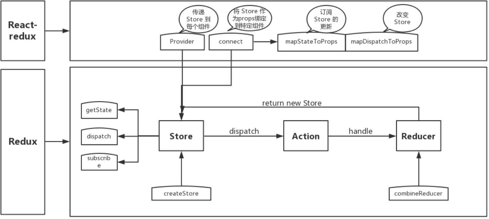

# React

## React最新的生命周期是怎么样的？

在 React 16 版本中，三个之前的生命周期被标识为废弃，并在 React 17 中计划全部删除它们：

- componentWillMount 

- componentWillReceiveProps 

- componentWillUpdate


当它们被删除后，将会只保留三个添加了`UNSAVE_`前缀的函数版本，作为向下兼容用途。因此我们在新项目中，要尽量避免使用这几个生命周期而使用最新的生命周期函数。

⽬前 React 16.8+ 的⽣命周期分为三个阶段：挂载阶段、更新阶段、卸载阶段。


**挂载阶段** 

`constructor` ：组件的构造函数，它会最先被执⾏，我们通常在构造函数⾥初始化 `state` 状态对象、或给⾃定义⽅法绑定 `this` 


`getDerivedStateFromProps` ：这是个静态⽅法，当我们接收到新的属性后想要去修改 `state` 时可以使用


`render`：这是个只返回需要渲染内容的纯函数，不要包含其它的业务逻辑，可以返回原⽣的 DOM、React 组件、Fragment、Portals、字符串和数字、Boolean 值 和 null 值等内容 


`componentDidMount` ：在组件装载后被调⽤，此时可以获取 DOM 节点并操作，对服务器的请求、订阅等操作都可以写在这个地方，但记得要在 `componentWillUnmount` 中取消订阅，即释放资源


**更新阶段** 

`getDerivedStateFromProps` ：此⽅法在更新个挂载阶段都可能会调⽤ 


`shouldComponentUpdate` ：该函数有两个参数 `nextProps` 和 `nextState`，表示新的属性和变化之后的状态；它返回⼀个布尔值，`true` 表示会触发重新渲染，`false` 则表示不会触发重新渲染，默认返回 `true`。我们通常利⽤该⽣命周期来优化 React 程序的性能


`render` ：更新阶段也会触发此⽣命周期 


`getSnapshotBeforeUpdate` ：该⽅法在 `render` 之后、在 `componentDidUpdate` 之前被调⽤，它有两个参数 `prevProps` 和`prevState`，表示之前的属性和状态，并且该函数有⼀个返回值，返回值会作为第三个参数传给 `componentDidUpdate` ，如果不想要返回值则返回 `null` 即可。该⽣命周期必须与 `componentDidUpdate` 搭配使⽤ 


`componentDidUpdate` ：该⽅法在 `getSnapshotBeforeUpdate` ⽅法之后被调⽤，它有三个参数 `prevProps` 、`prevState` 、`snapshot` ，表示之前的属性、之前的状态、以及`snapshot`。第三个参数是 `getSnapshotBeforeUpdate` 所返回的，如果触发某些回调函数时需要⽤到 DOM 元素的状态，则将对⽐或计算的过程迁移⾄ `getSnapshotBeforeUpdate`，然后在 `componentDidUpdate` 中统⼀触发回调或更新状态


**卸载阶段**

`componentWillUnmount` ：当组件被卸载或销毁时就会被调⽤，我们可以在这个函数⾥去做一些释放资源的操作，如：清除定时器、取消⽹络请求、清理⽆效的 DOM 元素等


[React生命周期图形示意工具](https://projects.wojtekmaj.pl/react-lifecycle-methods-diagram/)


## 在React中网络请求应该放在哪个生命周期中发起？

有人认为 React 中的网络异步请求，应该放在 `componentWillMount` 这个生命周期函数中发起，这样可以提前进⾏异步请求，以避免⽩屏现象。其实这个观点是有问题的。


由于 JavaScript 中异步事件的性质，当进行异步 API 调⽤时，浏览器会在此期间继续执⾏其他⼯作。因此，当 React 渲染⼀个组件时，它并不会等待 `componentWillMount` 执行完成任何事情，而是继续往前执行并继续做 `render` ，没有办法 “暂停” 渲染以等待远程数据的返回。


⽽且，在 `componentWillMount` 中发起请求会存在⼀系列潜在问题：

- 在用 React 作为服务器渲染（SSR）时，如果在 `componentWillMount` 中进行数据的获取，则 `fetch data` 会执⾏两次：⼀次在服务端，⼀次在客户端，这就造成了多余的请求

- 在 React 16 使用 React Fiber 架构重写后，`componentWillMount` 可能会在⼀次渲染中被多次调⽤。 


**⽬前官⽅推荐的是在 `componentDidmount` 中进行异步请求。** 


如遇到特殊需求，需要提前进行数据的请求，可考虑采用在 `constructor` 中进行。

另外，由于在 React 17 之后 `componentWillMount` 被废弃仅保留 `UNSAFE_componentWillMount`，所以要慎用该生命周期。


## setState是同步的还是异步的？

答案是：有时表现出异步，有时表现出同步！

- 在合成事件和生命周期钩⼦函数中是异步的
- 在原⽣事件和 `setTimeout` 中是同步的


`setState` 的异步并不是指内部由异步代码实现。其实，它本身执⾏的过程及代码都是同步的，只是由于合成事件和钩⼦函数的调⽤顺序在更新之前，因此导致了在合成事件和钩⼦函数中没法立刻拿到更新后的值，所以形成了所谓的异步。


当然，我们可以通过使用第⼆个参数来拿到更新后的结果，它是个回调函数：

```js
setState(partialState, callback)
```


此外，`setState` 的批量更新优化也是建⽴在异步（合成事件、钩⼦函数）之上的，在原⽣事件和 `setTimeout` 中不会批量更新。在异步中，如果对同⼀个值进⾏多次 `setState`，则它的批量更新策略会对其进⾏覆盖，只取最后⼀次的执⾏。如果同时 `setState` 多个不同的值，则会在更新时对其进⾏合并批量更新。


## React中如何实现组件间的通信？

组件间通信⽅式一共有如下几种： 


1. ⽗组件向⼦组件通讯

⽗组件可以通过向⼦组件传 `props` 的⽅式来实现父到子的通讯。


2. ⼦组件向⽗组件通讯

可以采用 `props + 回调` 的⽅式。

当⽗组件向⼦组件传递 `props` 进⾏通讯时，可在该 `props` 中传递一个回调函数，当⼦组件调⽤该函数时，可将⼦组件中想要传递给父组件的信息作为参数传递给该函数。由于 `props` 中的函数作⽤域为⽗组件⾃身，因此可以通过该函数内的 `setState` 更新到⽗组件上。 


3. 兄弟组件通信

可以通过兄弟节点的共同⽗节点，再结合以上2种⽅式，由⽗节点转发信息，实现兄弟间通信。 


4. 跨层级通信

可以采用 React 中的 `Context` 来实现跨越多层的全局数据通信。 

`Context` 设计的⽬的是为在⼀个组件树中共享 “全局” 数据，如：当前已登录的⽤户、界面主题、界面语⾔等信息。


5. 发布订阅模式

发布者发布事件，订阅者监听到事件后做出反应。

我们可以通过引⼊ `event` 模块进⾏此种方式的通信。


6. 全局状态管理⼯具

可以借助 `Redux` 或 `Mobx` 等全局状态管理⼯具进⾏通信，它们会维护⼀个全局状态中⼼（Store），并可以根据不同的事件产⽣新的状态。

 


## React存在哪些性能优化手段？

前端项目的性能手段，其实都是相通的。我们可以参考文章：[前端性能优化](https://blog.csdn.net/weixin_33976072/article/details/93168109)


## React中如何进行组件和逻辑的复用？

React 中的组件抽象的技术有以下几种: 

- 混合（mixin，官方已废弃）

- ⾼阶组件（hoc）：属性代理、反向继承 

- 渲染属性（render props）

- React Hooks（配合函数式组件使用，函数拆分的复用理念）


## Mixin、HoC、Render props、React Hooks的优缺点分别是什么？

**Mixin** 

- 组件与 Mixin 之间存在隐式依赖（Mixin 经常依赖于组件的特定⽅法，但在定义组件时并不知道这种依赖关系） 

- 多个 Mixin 之间可能产⽣冲突，⽐如：多个 Mixin 中定义了相同的 state 字段，在一个组件中同时引入这些 Mixin 后会产生字段冲突

- Mixin 倾向于增加更多状态，这降低了应⽤的可预测性，状态越多越难管理和溯源，复杂度剧增 

- 隐式依赖导致依赖关系不透明，维护成本和理解成本迅速攀升： 

  - 难以快速理解组件的⾏为，需要全盘了解所有依赖 Mixin 的扩展⾏为及其之间的相互影响 

  - 33333组件⾃身的⽅法和 state 字段不敢轻易删改，因为难以确定有没有 Mixin 依赖它 

  - Mixin 也难以维护，因为 Mixin 逻辑最后会被摊平合并到⼀起，很难搞清楚⼀个 Mixin 的输⼊输出


**HoC**

优点：

相⽐ Mixin，HoC 通过外层组件传递 props 来影响内层组件的状态，⽽不是直接改变其 state，这就不存在冲突和互相⼲扰，降低了耦合度。不同于 Mixin 的打平 + 合并，HoC 天然具有层级结构（组件树结构），这⼜降低了复杂度。

 

缺点： 

- 扩展性限制：HoC ⽆法从外部访问⼦组件的 state，因此⽆法通过 `shouldComponentUpdate` 滤掉不必要的更新；React 在⽀持ES6 Class 之后提供了 `React.PureComponent` 解决了这个问题 

- Ref 传递问题：Ref 被隔断。后来出现了 `React.forwardRef` 来解决了这个问题 

- 包装地狱（Wrapper Hell）：和回调函数类似，HoC 如果出现多层包裹组件的情况，就会和回调函数一样层层嵌套；而这种多层抽象同样也增加了复杂度和理解成本 

- 命名冲突：如果⾼阶组件多次嵌套而没有使⽤命名空间，就可能会产⽣冲突，覆盖⽼的属性 

- 不可⻅性：HoC 相当于在原有组件外层再包装⼀个组件，你有可能压根都不知道外层的包装是什么，对于你来说完全是⿊盒


**Render Props**

优点：

上述所说的 HoC 缺点，使用 Render Props 都可得到解决。 


缺点：

- 使⽤繁琐：HoC 使⽤只需要借助装饰器语法，通常⼀⾏代码就可以进⾏复⽤，而 Render Props ⽆法做到如此简单 

- 嵌套过深：Render Props 虽然摆脱了组件多层嵌套问题，但其又会走回到了回调函数的嵌套问题


**React Hooks**

优点：

- 简洁：React Hooks 解决了 HoC 和 Render Props 的嵌套问题，代码更加简洁

- 解耦：React Hooks 可以更⽅便地把 UI 和状态分离，做到更彻底的解耦

- 组合：Hooks 中可以通过引⽤另外的 Hooks 以此形成新的 Hooks，变化丰富

- 函数友好：React Hooks 为函数组件⽽⽣，从⽽解决了类组件的⼏⼤问题: 

  - this 指向容易错误 
  - 分割在不同声明周期中的逻辑会使得代码难以理解和维护 

  - 代码复⽤成本⾼（⾼阶组件容易使代码量剧增） 


缺点： 

- 有额外的学习成本（需要学习和区分类组件、函数组件） 

- 写法上有限制（不能出现在条件、循环中），并且这种写法限制会增加代码重构时的成本 

- 破坏了 `PureComponent`、`React.memo` 浅⽐较的性能优化效果（为了获取最新的 props 和 state，每次 `render()` 都要重新 

创建事件处理函数）

- 在闭包场景中可能会引⽤到旧的 state、props 值
- 内部实现上不直观（依赖⼀份可变的全局状态，不再那么“纯”） 
- `React.memo` 并不能完全替代 `shouldComponentUpdate`（因为获取不到 state 的变化，只针对 props 的变化）


## Redux的工作流程是怎么样的？

**核心概念**

- `Store`：一个保存数据的容器，整个应⽤只有⼀个 Store

- `State`：Store 对象内包含所有数据，如想得到某一时间点的数据，就要对 Store ⽣成快照，这种时间点的数据集合，就叫 State

- `Action`：State 的变化会导致 View 的变化，但⽤户是接触不到 State 的，只能接触到 View，所以 State 的变化必须是 View 导致的。Action 就是 View 发出的通知，表示 State 应该要发⽣变化了

- `Action Creator`：View 要发送多少种消息，就需要有多少种 Action，如果都⼿写会比较麻烦，因此我们通常会定义一个用于生成 Action 的函数，该函数就被称为 Action Creator

- `Reducer`：在 Store 收到 Action 以后，必须给出⼀个新的 State，这样 View 才会发⽣变化。这种 State 的计算过程就叫做Reducer。Reducer 是⼀个函数，它接收 Action 和当前 State 作为参数，返回值是⼀个新的 State

- `dispatch`：是 View 发送 Action 的唯⼀⽅法


**⼯作流程**


⼀次⽤户交互的流程如下：

1. ⾸先，View（通过⽤户）发出 Action，发出⽅式就是使用 `dispatch` ⽅法 

2. 然后，Store 调⽤ Reducer 并且传⼊两个参数（当前的 State 和收到的 Action），Reducer 处理后返回新的 State 

3. State ⼀旦有变化，则 Store 会调⽤监听函数来通知 View 进行更新


注意，在整个流程中，数据都是单向流动的，我们称之为单向数据流，这种⽅式可以保证流程的清晰性。


## react-redux这个库是如何工作的？

**核心概念**

**`Provider`**

Provider 的作⽤是从最外部封装了整个应⽤，并向 `connect` 模块传递 `store` 。


**`connect`**

负责将 React 和 Redux 关联起来，它的作用主要如下：

- 获取 `state`：`connect` 先通过 `context` 来获取存放在 `Provider` 中的 `store`，然后通过 `store.getState()` 来获取整个 `store tree` 上所存放的 `state` 

- 包装原组件：`connect` 将 `state` 和 `action` 通过 `props` 传⼊到原组件的内部，并调用 `wrapWithConnect` 函数来包装和返回⼀个 `Connect` 对象，`Connect` 对象重新 `render` 外部传⼊的原组件，并把 `connect` 中传⼊的 `mapStateToProps` 和 `mapDispatchToProps` 与组件原有的 `props` 合并后，通过属性的⽅式传给包装组件 

- 监听 `store tree` 变化：`connect` 缓存了 `store tree` 中 `state` 的状态，通过对比当前 `state ` 和变更前 `state`，确定是否需要调⽤ `this.setState()` ⽅法，以此触发 `Connect` 及其⼦组件的重新渲染


**流程图**




## Redux和Mobx的区别？

| 比较点     | Redux                                                        | Mobx                                                         |
| ---------- | ------------------------------------------------------------ | ------------------------------------------------------------ |
| 存储方式   | 保存在单⼀的 store 中                                        | 保存在分散的多个 store 中                                    |
| 数据结构   | 使⽤ plain object 保存数据，需要⼿动处理变化后的操作         | 使⽤ observable 保存数据，数据变化后⾃动处理响应的操作（类似 Vuex） |
| 数据可变性 | 不可变状态，只读不能直接修改，应使⽤纯函数返回⼀个新状态     | 状态是可变的，可直接进⾏修改                                 |
| 难易度     | 比较复杂<br />涉及函数式编程思想，掌握起来不那么容易，同时需借助⼀些中间件处理异步和副作⽤ | 比较简单<br />使用面向对象的编程思维                         |
| 调试       | 容易<br />使用纯函数，并提供了时间回溯⼯具，因此调试直观方便 | ⽐较困难<br />有更多的对象抽象和封装，调试会⽐较困难         |


**使⽤场景**

`Mobx`

- 更适合数据不复杂的应⽤。因为 mobx 难以调试，很多状态⽆法回溯，⾯对复杂度⾼的应⽤时往往⼒不从⼼

- 适合短平快的项⽬。因为 mobx上⼿简单，样板代码少，很⼤程度上提⾼了开发效率


`Redux`

- 适合有回溯需求的应⽤。⽐如，画板、表格等应⽤，一般有撤销、重做等操作，由于 Redux 具有不可变的特性，天然⽀持这些操作 


我们也可以在一个项目中同时使用 `Mobx` 和 `Redux` ，让两者发挥各自的长处，比如：

- 使用 `Redux` 作为全局状态管理
- 使⽤ `Mobx `作为组件的局部状态管理器


## 在Redux中如何进行异步操作？

一般项目中，我们可以直接在 `componentDidMount` 中进⾏异步操作，比如发送网络请求，⽆须借助 Redux。但如果我们的项目上了一定的规模，这种方法再管理异步流的时候就比较困难。这个时候，我们会借助 Redux 的异步中间件来进⾏异步处理。 

Redux 其实有多种异步中间件，但当下主流的只有两种：`redux-thunk` 和 `redux-saga`。

**redux-thunk**

优点：

- 体积⼩：redux-thunk 的实现⽅式很简单，只有不到20⾏代码 

- 使⽤简单：redux-thunk 没有引⼊像 redux-saga 或者 redux-observable 额外的编程范式，上⼿非常简单 


缺点：

- 样板代码过多：与 redux 本身⼀样，通常发送⼀个请求就需要编写⼤量代码，⽽且很多都是重复性的 

- 耦合严重：异步操作与 redux 的 action 偶合在⼀起，不⽅便管理 

- 功能薄弱：实际开发中常⽤的⼀些功能都需要⾃⼰封装 


**redux-saga**

优点：

- 异步解耦：异步操作被被转移到了单独的 saga.js 中，不再是掺杂在 action.js 或 component.js 中 

- action 摆脱了 thunk function：dispatch 的参数依然是⼀个纯粹的 action (FSA)，⽽不是充满了 “⿊魔法” 的 thunk function 
- 异常处理：受益于 Generator Function 的 saga 实现，代码异常/请求失败都可直接通过 try/catch 捕获处理 

- 功能强⼤：redux-saga 提供了⼤量的 Saga 辅助函数和 Effect 创建器，开发者⽆须自行封装、或只要简单封装即可使⽤ 

- 灵活：redux-saga 可将多个 Saga 进行串⾏或并⾏组合，形成⼀个⾮常实⽤的异步流程 

- 易测试：提供了各种测试⽅案，包括 mock task、分⽀覆盖等


缺点：

- 额外的学习成本：redux-saga 不仅使⽤了难以理解的 Generator Function，⽽且存在数⼗个 API，学习成本远超 redux-thunk；最重要的是，这些额外的学习成本只能用于使用这个库的（而对于 redux-observable 来说，它虽也有学习成本，但它基于 rxjs ，这套编程思想和技术体系可以沿用到其他地方去）

- 体积庞⼤：代码近 2000 ⾏（压缩后大约 25KB） 

- 功能过剩：其中提供的并发控制等功能，实际开发中很难会⽤到，但我们依然要引⼊这些代码 

- 对 TS ⽀持不友好：yield ⽆法返回 TS 类型 


**redux-observable**

优点：

- 功能最强：由于基于 rxjs 这个强⼤的响应式编程库，借助 rxjs 的操作符⼏乎可以做任何你能想到的异步处理 

- 知识沿用：如果你已学习过 rxjs，那么 redux-observable 的学习成本并不⾼；⽽且，随着 rxjs 的升级，redux-observable 也会变得更强⼤ 


缺点：

- 学习成本奇⾼：对于还不会 rxjs 的开发者来说，需要额外的学习两个都较为复杂的库 

- 社区⼀般：redux-observable 下载量只有 redux-saga 的 1/5，社区不够活跃，而 redux-saga 仍处于领导地位 